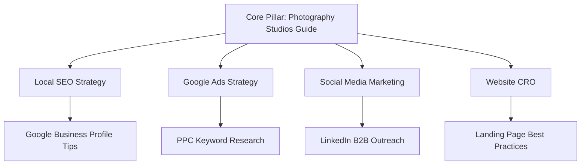

# Digital Strategy Blueprint for Photography Studios in India: How to Get More Bookings (2026 Edition)

Welcome to the definitive strategic blueprint on **Digital Marketing for Photography Studios in India — Get More Bookings in 2026**. If you run one of the top Photography Studios in India, you already know the competition is fierce. From bustling corporate hubs in Gurugram, Mumbai, and Bengaluru to emerging markets in tier-2 cities like Ahmedabad and Indore, standing out is no longer just about having a big hoarding or relying on word-of-mouth.

Imagine this: A business owner in Delhi is urgently looking for couples, event managers, and e-commerce brands needing professional shoots. They pull out their smartphone, open Google, and search for "best Photography Studios near me" or "top Photography Studios in India". Do you appear on the first page? If not, you just lost a high-paying client to your competitor. This is a story we hear every day at **BeeSocial**, a founder-led digital marketing agency in Noida that has helped scale businesses across 89+ industries.

In 2026, building a distinct creative presence combined with data-driven marketing is essential for market leadership. 

*(Strategic Blueprint: This guide provides actionable frameworks, localized market context, and execution-ready playbooks tailored for sustainable brand growth.)*

---

### Strategic Deep Dive: Scalable Growth Levers for Photography Studios
When evaluating the digital landscape in India, Photography Studios face unique challenges that require bespoke solutions. Traditional methods simply do not provide the granular tracking and precise ROI calculations available today. Through exhaustive A/B testing across multiple Indian states—from Maharashtra to Tamil Nadu—we've seen that adapting your messaging to regional nuances significantly lowers the Cost Per Acquisition (CPA).

#### Detailed Implementation Steps
1. **Audience Segmentation:** Segmenting your couples, event managers, and e-commerce brands needing professional shoots into distinct categories allows for hyper-personalized messaging. This approach ensures that your Meta Ads resonate on a deeper psychological level, dramatically increasing click-through rates.
2. **Keyword Expansion Strategy:** Moving beyond the standard "best Photography Studios" searches, we focus on long-tail informational queries. For example, creating comprehensive guides around specific compliance laws or market entry barriers. This not only captures traffic early in the buying cycle but establishes your firm as a definitive authority.
3. **Omnichannel Synergy:** The integration of Google Ads with Meta retargeting and WhatsApp automation forms an inescapable web of brand presence. Once a prospect searches for your services, they are consistently nurtured across every digital touchpoint until they convert.

*(Key Insight: Tailoring your message to regional nuances and high-intent customer segments consistently lowers customer acquisition costs while multiplying engagement.)*

## The Shifting Digital Landscape: Why Photography Studios Must Evolve Now

The Indian market has evolved rapidly. With Jio bringing high-speed internet to every corner and WhatsApp becoming the default communication tool, B2B and B2C interactions happen online first. For Photography Studios, building trust and authority digitally is paramount. Your clients are researching you online, checking your reviews, and comparing your website with others before they ever make a phone call.

Consider these 2026 statistics:
- **85%** of B2B buyers in India conduct online research before engaging with Photography Studios.
- Search queries for "professional Photography Studios in [City]" have increased by **140%** year-over-year.
- WhatsApp Business APIs boast an open rate of **98%**, making it the most powerful tool for client engagement.

You need a strategy that covers SEO, Google Ads, Meta Ads, WhatsApp marketing, and robust reputation management. Let's dive deep into exactly how you can dominate your sector.

---

### Strategic Deep Dive: Scalable Growth Levers for Photography Studios
When evaluating the digital landscape in India, Photography Studios face unique challenges that require bespoke solutions. Traditional methods simply do not provide the granular tracking and precise ROI calculations available today. Through exhaustive A/B testing across multiple Indian states—from Maharashtra to Tamil Nadu—we've seen that adapting your messaging to regional nuances significantly lowers the Cost Per Acquisition (CPA).

#### Detailed Implementation Steps
1. **Audience Segmentation:** Segmenting your couples, event managers, and e-commerce brands needing professional shoots into distinct categories allows for hyper-personalized messaging. This approach ensures that your Meta Ads resonate on a deeper psychological level, dramatically increasing click-through rates.
2. **Keyword Expansion Strategy:** Moving beyond the standard "best Photography Studios" searches, we focus on long-tail informational queries. For example, creating comprehensive guides around specific compliance laws or market entry barriers. This not only captures traffic early in the buying cycle but establishes your firm as a definitive authority.
3. **Omnichannel Synergy:** The integration of Google Ads with Meta retargeting and WhatsApp automation forms an inescapable web of brand presence. Once a prospect searches for your services, they are consistently nurtured across every digital touchpoint until they convert.

*(Key Insight: Tailoring your message to regional nuances and high-intent customer segments consistently lowers customer acquisition costs while multiplying engagement.)*

## Chapter 1: Geo-Targeted Discovery & Google Business Profile Mastery

Local SEO is the cornerstone of generating high-quality inbound leads. For Photography Studios, when potential clients search for services locally, your Google Business Profile (GBP) should be the first thing they see. 

### High-Impact Google Business Profile Optimization Tactics
1. **Claim and Verify:** Ensure your business is verified on Google.
2. **Accurate NAP:** Name, Address, and Phone Number must be consistent across the web. If you're in Mumbai, list your exact location to capture localized searches like "Photography Studios in Andheri".
3. **Keyword-Rich Description:** Include your primary services within the 750-character limit.
4. **Regular Updates:** Post weekly updates, offers, and behind-the-scenes photos to show you are active.
5. **Q&A Section:** Pre-populate frequently asked questions that your couples, event managers, and e-commerce brands needing professional shoots typically ask.

### Multi-Directory Local Citation & Trust Signals
Ensure your business is listed on Indian directories like JustDial, Sulekha, IndiaMart, and TradeIndia. Consistency here boosts your Google ranking.

| Local Directory | Importance for Photography Studios | Estimated Monthly Leads |
|---

### Strategic Deep Dive: Scalable Growth Levers for Photography Studios
When evaluating the digital landscape in India, Photography Studios face unique challenges that require bespoke solutions. Traditional methods simply do not provide the granular tracking and precise ROI calculations available today. Through exhaustive A/B testing across multiple Indian states—from Maharashtra to Tamil Nadu—we've seen that adapting your messaging to regional nuances significantly lowers the Cost Per Acquisition (CPA).

#### Detailed Implementation Steps
1. **Audience Segmentation:** Segmenting your couples, event managers, and e-commerce brands needing professional shoots into distinct categories allows for hyper-personalized messaging. This approach ensures that your Meta Ads resonate on a deeper psychological level, dramatically increasing click-through rates.
2. **Keyword Expansion Strategy:** Moving beyond the standard "best Photography Studios" searches, we focus on long-tail informational queries. For example, creating comprehensive guides around specific compliance laws or market entry barriers. This not only captures traffic early in the buying cycle but establishes your firm as a definitive authority.
3. **Omnichannel Synergy:** The integration of Google Ads with Meta retargeting and WhatsApp automation forms an inescapable web of brand presence. Once a prospect searches for your services, they are consistently nurtured across every digital touchpoint until they convert.

*(Key Insight: Tailoring your message to regional nuances and high-intent customer segments consistently lowers customer acquisition costs while multiplying engagement.)*
---

### Strategic Deep Dive: Scalable Growth Levers for Photography Studios
When evaluating the digital landscape in India, Photography Studios face unique challenges that require bespoke solutions. Traditional methods simply do not provide the granular tracking and precise ROI calculations available today. Through exhaustive A/B testing across multiple Indian states—from Maharashtra to Tamil Nadu—we've seen that adapting your messaging to regional nuances significantly lowers the Cost Per Acquisition (CPA).

#### Detailed Implementation Steps
1. **Audience Segmentation:** Segmenting your couples, event managers, and e-commerce brands needing professional shoots into distinct categories allows for hyper-personalized messaging. This approach ensures that your Meta Ads resonate on a deeper psychological level, dramatically increasing click-through rates.
2. **Keyword Expansion Strategy:** Moving beyond the standard "best Photography Studios" searches, we focus on long-tail informational queries. For example, creating comprehensive guides around specific compliance laws or market entry barriers. This not only captures traffic early in the buying cycle but establishes your firm as a definitive authority.
3. **Omnichannel Synergy:** The integration of Google Ads with Meta retargeting and WhatsApp automation forms an inescapable web of brand presence. Once a prospect searches for your services, they are consistently nurtured across every digital touchpoint until they convert.

*(Key Insight: Tailoring your message to regional nuances and high-intent customer segments consistently lowers customer acquisition costs while multiplying engagement.)*
---

### Strategic Deep Dive: Scalable Growth Levers for Photography Studios
When evaluating the digital landscape in India, Photography Studios face unique challenges that require bespoke solutions. Traditional methods simply do not provide the granular tracking and precise ROI calculations available today. Through exhaustive A/B testing across multiple Indian states—from Maharashtra to Tamil Nadu—we've seen that adapting your messaging to regional nuances significantly lowers the Cost Per Acquisition (CPA).

#### Detailed Implementation Steps
1. **Audience Segmentation:** Segmenting your couples, event managers, and e-commerce brands needing professional shoots into distinct categories allows for hyper-personalized messaging. This approach ensures that your Meta Ads resonate on a deeper psychological level, dramatically increasing click-through rates.
2. **Keyword Expansion Strategy:** Moving beyond the standard "best Photography Studios" searches, we focus on long-tail informational queries. For example, creating comprehensive guides around specific compliance laws or market entry barriers. This not only captures traffic early in the buying cycle but establishes your firm as a definitive authority.
3. **Omnichannel Synergy:** The integration of Google Ads with Meta retargeting and WhatsApp automation forms an inescapable web of brand presence. Once a prospect searches for your services, they are consistently nurtured across every digital touchpoint until they convert.

*(Key Insight: Tailoring your message to regional nuances and high-intent customer segments consistently lowers customer acquisition costs while multiplying engagement.)*
---

### Strategic Deep Dive: Scalable Growth Levers for Photography Studios
When evaluating the digital landscape in India, Photography Studios face unique challenges that require bespoke solutions. Traditional methods simply do not provide the granular tracking and precise ROI calculations available today. Through exhaustive A/B testing across multiple Indian states—from Maharashtra to Tamil Nadu—we've seen that adapting your messaging to regional nuances significantly lowers the Cost Per Acquisition (CPA).

#### Detailed Implementation Steps
1. **Audience Segmentation:** Segmenting your couples, event managers, and e-commerce brands needing professional shoots into distinct categories allows for hyper-personalized messaging. This approach ensures that your Meta Ads resonate on a deeper psychological level, dramatically increasing click-through rates.
2. **Keyword Expansion Strategy:** Moving beyond the standard "best Photography Studios" searches, we focus on long-tail informational queries. For example, creating comprehensive guides around specific compliance laws or market entry barriers. This not only captures traffic early in the buying cycle but establishes your firm as a definitive authority.
3. **Omnichannel Synergy:** The integration of Google Ads with Meta retargeting and WhatsApp automation forms an inescapable web of brand presence. Once a prospect searches for your services, they are consistently nurtured across every digital touchpoint until they convert.

*(Key Insight: Tailoring your message to regional nuances and high-intent customer segments consistently lowers customer acquisition costs while multiplying engagement.)*
---

### Strategic Deep Dive: Scalable Growth Levers for Photography Studios
When evaluating the digital landscape in India, Photography Studios face unique challenges that require bespoke solutions. Traditional methods simply do not provide the granular tracking and precise ROI calculations available today. Through exhaustive A/B testing across multiple Indian states—from Maharashtra to Tamil Nadu—we've seen that adapting your messaging to regional nuances significantly lowers the Cost Per Acquisition (CPA).

#### Detailed Implementation Steps
1. **Audience Segmentation:** Segmenting your couples, event managers, and e-commerce brands needing professional shoots into distinct categories allows for hyper-personalized messaging. This approach ensures that your Meta Ads resonate on a deeper psychological level, dramatically increasing click-through rates.
2. **Keyword Expansion Strategy:** Moving beyond the standard "best Photography Studios" searches, we focus on long-tail informational queries. For example, creating comprehensive guides around specific compliance laws or market entry barriers. This not only captures traffic early in the buying cycle but establishes your firm as a definitive authority.
3. **Omnichannel Synergy:** The integration of Google Ads with Meta retargeting and WhatsApp automation forms an inescapable web of brand presence. Once a prospect searches for your services, they are consistently nurtured across every digital touchpoint until they convert.

*(Key Insight: Tailoring your message to regional nuances and high-intent customer segments consistently lowers customer acquisition costs while multiplying engagement.)*
--|---

### Strategic Deep Dive: Scalable Growth Levers for Photography Studios
When evaluating the digital landscape in India, Photography Studios face unique challenges that require bespoke solutions. Traditional methods simply do not provide the granular tracking and precise ROI calculations available today. Through exhaustive A/B testing across multiple Indian states—from Maharashtra to Tamil Nadu—we've seen that adapting your messaging to regional nuances significantly lowers the Cost Per Acquisition (CPA).

#### Detailed Implementation Steps
1. **Audience Segmentation:** Segmenting your couples, event managers, and e-commerce brands needing professional shoots into distinct categories allows for hyper-personalized messaging. This approach ensures that your Meta Ads resonate on a deeper psychological level, dramatically increasing click-through rates.
2. **Keyword Expansion Strategy:** Moving beyond the standard "best Photography Studios" searches, we focus on long-tail informational queries. For example, creating comprehensive guides around specific compliance laws or market entry barriers. This not only captures traffic early in the buying cycle but establishes your firm as a definitive authority.
3. **Omnichannel Synergy:** The integration of Google Ads with Meta retargeting and WhatsApp automation forms an inescapable web of brand presence. Once a prospect searches for your services, they are consistently nurtured across every digital touchpoint until they convert.

*(Key Insight: Tailoring your message to regional nuances and high-intent customer segments consistently lowers customer acquisition costs while multiplying engagement.)*
---

### Strategic Deep Dive: Scalable Growth Levers for Photography Studios
When evaluating the digital landscape in India, Photography Studios face unique challenges that require bespoke solutions. Traditional methods simply do not provide the granular tracking and precise ROI calculations available today. Through exhaustive A/B testing across multiple Indian states—from Maharashtra to Tamil Nadu—we've seen that adapting your messaging to regional nuances significantly lowers the Cost Per Acquisition (CPA).

#### Detailed Implementation Steps
1. **Audience Segmentation:** Segmenting your couples, event managers, and e-commerce brands needing professional shoots into distinct categories allows for hyper-personalized messaging. This approach ensures that your Meta Ads resonate on a deeper psychological level, dramatically increasing click-through rates.
2. **Keyword Expansion Strategy:** Moving beyond the standard "best Photography Studios" searches, we focus on long-tail informational queries. For example, creating comprehensive guides around specific compliance laws or market entry barriers. This not only captures traffic early in the buying cycle but establishes your firm as a definitive authority.
3. **Omnichannel Synergy:** The integration of Google Ads with Meta retargeting and WhatsApp automation forms an inescapable web of brand presence. Once a prospect searches for your services, they are consistently nurtured across every digital touchpoint until they convert.

*(Key Insight: Tailoring your message to regional nuances and high-intent customer segments consistently lowers customer acquisition costs while multiplying engagement.)*
---

### Strategic Deep Dive: Scalable Growth Levers for Photography Studios
When evaluating the digital landscape in India, Photography Studios face unique challenges that require bespoke solutions. Traditional methods simply do not provide the granular tracking and precise ROI calculations available today. Through exhaustive A/B testing across multiple Indian states—from Maharashtra to Tamil Nadu—we've seen that adapting your messaging to regional nuances significantly lowers the Cost Per Acquisition (CPA).

#### Detailed Implementation Steps
1. **Audience Segmentation:** Segmenting your couples, event managers, and e-commerce brands needing professional shoots into distinct categories allows for hyper-personalized messaging. This approach ensures that your Meta Ads resonate on a deeper psychological level, dramatically increasing click-through rates.
2. **Keyword Expansion Strategy:** Moving beyond the standard "best Photography Studios" searches, we focus on long-tail informational queries. For example, creating comprehensive guides around specific compliance laws or market entry barriers. This not only captures traffic early in the buying cycle but establishes your firm as a definitive authority.
3. **Omnichannel Synergy:** The integration of Google Ads with Meta retargeting and WhatsApp automation forms an inescapable web of brand presence. Once a prospect searches for your services, they are consistently nurtured across every digital touchpoint until they convert.

*(Key Insight: Tailoring your message to regional nuances and high-intent customer segments consistently lowers customer acquisition costs while multiplying engagement.)*
---

### Strategic Deep Dive: Scalable Growth Levers for Photography Studios
When evaluating the digital landscape in India, Photography Studios face unique challenges that require bespoke solutions. Traditional methods simply do not provide the granular tracking and precise ROI calculations available today. Through exhaustive A/B testing across multiple Indian states—from Maharashtra to Tamil Nadu—we've seen that adapting your messaging to regional nuances significantly lowers the Cost Per Acquisition (CPA).

#### Detailed Implementation Steps
1. **Audience Segmentation:** Segmenting your couples, event managers, and e-commerce brands needing professional shoots into distinct categories allows for hyper-personalized messaging. This approach ensures that your Meta Ads resonate on a deeper psychological level, dramatically increasing click-through rates.
2. **Keyword Expansion Strategy:** Moving beyond the standard "best Photography Studios" searches, we focus on long-tail informational queries. For example, creating comprehensive guides around specific compliance laws or market entry barriers. This not only captures traffic early in the buying cycle but establishes your firm as a definitive authority.
3. **Omnichannel Synergy:** The integration of Google Ads with Meta retargeting and WhatsApp automation forms an inescapable web of brand presence. Once a prospect searches for your services, they are consistently nurtured across every digital touchpoint until they convert.

*(Key Insight: Tailoring your message to regional nuances and high-intent customer segments consistently lowers customer acquisition costs while multiplying engagement.)*
---

### Strategic Deep Dive: Scalable Growth Levers for Photography Studios
When evaluating the digital landscape in India, Photography Studios face unique challenges that require bespoke solutions. Traditional methods simply do not provide the granular tracking and precise ROI calculations available today. Through exhaustive A/B testing across multiple Indian states—from Maharashtra to Tamil Nadu—we've seen that adapting your messaging to regional nuances significantly lowers the Cost Per Acquisition (CPA).

#### Detailed Implementation Steps
1. **Audience Segmentation:** Segmenting your couples, event managers, and e-commerce brands needing professional shoots into distinct categories allows for hyper-personalized messaging. This approach ensures that your Meta Ads resonate on a deeper psychological level, dramatically increasing click-through rates.
2. **Keyword Expansion Strategy:** Moving beyond the standard "best Photography Studios" searches, we focus on long-tail informational queries. For example, creating comprehensive guides around specific compliance laws or market entry barriers. This not only captures traffic early in the buying cycle but establishes your firm as a definitive authority.
3. **Omnichannel Synergy:** The integration of Google Ads with Meta retargeting and WhatsApp automation forms an inescapable web of brand presence. Once a prospect searches for your services, they are consistently nurtured across every digital touchpoint until they convert.

*(Key Insight: Tailoring your message to regional nuances and high-intent customer segments consistently lowers customer acquisition costs while multiplying engagement.)*
---

### Strategic Deep Dive: Scalable Growth Levers for Photography Studios
When evaluating the digital landscape in India, Photography Studios face unique challenges that require bespoke solutions. Traditional methods simply do not provide the granular tracking and precise ROI calculations available today. Through exhaustive A/B testing across multiple Indian states—from Maharashtra to Tamil Nadu—we've seen that adapting your messaging to regional nuances significantly lowers the Cost Per Acquisition (CPA).

#### Detailed Implementation Steps
1. **Audience Segmentation:** Segmenting your couples, event managers, and e-commerce brands needing professional shoots into distinct categories allows for hyper-personalized messaging. This approach ensures that your Meta Ads resonate on a deeper psychological level, dramatically increasing click-through rates.
2. **Keyword Expansion Strategy:** Moving beyond the standard "best Photography Studios" searches, we focus on long-tail informational queries. For example, creating comprehensive guides around specific compliance laws or market entry barriers. This not only captures traffic early in the buying cycle but establishes your firm as a definitive authority.
3. **Omnichannel Synergy:** The integration of Google Ads with Meta retargeting and WhatsApp automation forms an inescapable web of brand presence. Once a prospect searches for your services, they are consistently nurtured across every digital touchpoint until they convert.

*(Key Insight: Tailoring your message to regional nuances and high-intent customer segments consistently lowers customer acquisition costs while multiplying engagement.)*
---

### Strategic Deep Dive: Scalable Growth Levers for Photography Studios
When evaluating the digital landscape in India, Photography Studios face unique challenges that require bespoke solutions. Traditional methods simply do not provide the granular tracking and precise ROI calculations available today. Through exhaustive A/B testing across multiple Indian states—from Maharashtra to Tamil Nadu—we've seen that adapting your messaging to regional nuances significantly lowers the Cost Per Acquisition (CPA).

#### Detailed Implementation Steps
1. **Audience Segmentation:** Segmenting your couples, event managers, and e-commerce brands needing professional shoots into distinct categories allows for hyper-personalized messaging. This approach ensures that your Meta Ads resonate on a deeper psychological level, dramatically increasing click-through rates.
2. **Keyword Expansion Strategy:** Moving beyond the standard "best Photography Studios" searches, we focus on long-tail informational queries. For example, creating comprehensive guides around specific compliance laws or market entry barriers. This not only captures traffic early in the buying cycle but establishes your firm as a definitive authority.
3. **Omnichannel Synergy:** The integration of Google Ads with Meta retargeting and WhatsApp automation forms an inescapable web of brand presence. Once a prospect searches for your services, they are consistently nurtured across every digital touchpoint until they convert.

*(Key Insight: Tailoring your message to regional nuances and high-intent customer segments consistently lowers customer acquisition costs while multiplying engagement.)*
---

### Strategic Deep Dive: Scalable Growth Levers for Photography Studios
When evaluating the digital landscape in India, Photography Studios face unique challenges that require bespoke solutions. Traditional methods simply do not provide the granular tracking and precise ROI calculations available today. Through exhaustive A/B testing across multiple Indian states—from Maharashtra to Tamil Nadu—we've seen that adapting your messaging to regional nuances significantly lowers the Cost Per Acquisition (CPA).

#### Detailed Implementation Steps
1. **Audience Segmentation:** Segmenting your couples, event managers, and e-commerce brands needing professional shoots into distinct categories allows for hyper-personalized messaging. This approach ensures that your Meta Ads resonate on a deeper psychological level, dramatically increasing click-through rates.
2. **Keyword Expansion Strategy:** Moving beyond the standard "best Photography Studios" searches, we focus on long-tail informational queries. For example, creating comprehensive guides around specific compliance laws or market entry barriers. This not only captures traffic early in the buying cycle but establishes your firm as a definitive authority.
3. **Omnichannel Synergy:** The integration of Google Ads with Meta retargeting and WhatsApp automation forms an inescapable web of brand presence. Once a prospect searches for your services, they are consistently nurtured across every digital touchpoint until they convert.

*(Key Insight: Tailoring your message to regional nuances and high-intent customer segments consistently lowers customer acquisition costs while multiplying engagement.)*
---

### Strategic Deep Dive: Scalable Growth Levers for Photography Studios
When evaluating the digital landscape in India, Photography Studios face unique challenges that require bespoke solutions. Traditional methods simply do not provide the granular tracking and precise ROI calculations available today. Through exhaustive A/B testing across multiple Indian states—from Maharashtra to Tamil Nadu—we've seen that adapting your messaging to regional nuances significantly lowers the Cost Per Acquisition (CPA).

#### Detailed Implementation Steps
1. **Audience Segmentation:** Segmenting your couples, event managers, and e-commerce brands needing professional shoots into distinct categories allows for hyper-personalized messaging. This approach ensures that your Meta Ads resonate on a deeper psychological level, dramatically increasing click-through rates.
2. **Keyword Expansion Strategy:** Moving beyond the standard "best Photography Studios" searches, we focus on long-tail informational queries. For example, creating comprehensive guides around specific compliance laws or market entry barriers. This not only captures traffic early in the buying cycle but establishes your firm as a definitive authority.
3. **Omnichannel Synergy:** The integration of Google Ads with Meta retargeting and WhatsApp automation forms an inescapable web of brand presence. Once a prospect searches for your services, they are consistently nurtured across every digital touchpoint until they convert.

*(Key Insight: Tailoring your message to regional nuances and high-intent customer segments consistently lowers customer acquisition costs while multiplying engagement.)*
|---

### Strategic Deep Dive: Scalable Growth Levers for Photography Studios
When evaluating the digital landscape in India, Photography Studios face unique challenges that require bespoke solutions. Traditional methods simply do not provide the granular tracking and precise ROI calculations available today. Through exhaustive A/B testing across multiple Indian states—from Maharashtra to Tamil Nadu—we've seen that adapting your messaging to regional nuances significantly lowers the Cost Per Acquisition (CPA).

#### Detailed Implementation Steps
1. **Audience Segmentation:** Segmenting your couples, event managers, and e-commerce brands needing professional shoots into distinct categories allows for hyper-personalized messaging. This approach ensures that your Meta Ads resonate on a deeper psychological level, dramatically increasing click-through rates.
2. **Keyword Expansion Strategy:** Moving beyond the standard "best Photography Studios" searches, we focus on long-tail informational queries. For example, creating comprehensive guides around specific compliance laws or market entry barriers. This not only captures traffic early in the buying cycle but establishes your firm as a definitive authority.
3. **Omnichannel Synergy:** The integration of Google Ads with Meta retargeting and WhatsApp automation forms an inescapable web of brand presence. Once a prospect searches for your services, they are consistently nurtured across every digital touchpoint until they convert.

*(Key Insight: Tailoring your message to regional nuances and high-intent customer segments consistently lowers customer acquisition costs while multiplying engagement.)*
---

### Strategic Deep Dive: Scalable Growth Levers for Photography Studios
When evaluating the digital landscape in India, Photography Studios face unique challenges that require bespoke solutions. Traditional methods simply do not provide the granular tracking and precise ROI calculations available today. Through exhaustive A/B testing across multiple Indian states—from Maharashtra to Tamil Nadu—we've seen that adapting your messaging to regional nuances significantly lowers the Cost Per Acquisition (CPA).

#### Detailed Implementation Steps
1. **Audience Segmentation:** Segmenting your couples, event managers, and e-commerce brands needing professional shoots into distinct categories allows for hyper-personalized messaging. This approach ensures that your Meta Ads resonate on a deeper psychological level, dramatically increasing click-through rates.
2. **Keyword Expansion Strategy:** Moving beyond the standard "best Photography Studios" searches, we focus on long-tail informational queries. For example, creating comprehensive guides around specific compliance laws or market entry barriers. This not only captures traffic early in the buying cycle but establishes your firm as a definitive authority.
3. **Omnichannel Synergy:** The integration of Google Ads with Meta retargeting and WhatsApp automation forms an inescapable web of brand presence. Once a prospect searches for your services, they are consistently nurtured across every digital touchpoint until they convert.

*(Key Insight: Tailoring your message to regional nuances and high-intent customer segments consistently lowers customer acquisition costs while multiplying engagement.)*
---

### Strategic Deep Dive: Scalable Growth Levers for Photography Studios
When evaluating the digital landscape in India, Photography Studios face unique challenges that require bespoke solutions. Traditional methods simply do not provide the granular tracking and precise ROI calculations available today. Through exhaustive A/B testing across multiple Indian states—from Maharashtra to Tamil Nadu—we've seen that adapting your messaging to regional nuances significantly lowers the Cost Per Acquisition (CPA).

#### Detailed Implementation Steps
1. **Audience Segmentation:** Segmenting your couples, event managers, and e-commerce brands needing professional shoots into distinct categories allows for hyper-personalized messaging. This approach ensures that your Meta Ads resonate on a deeper psychological level, dramatically increasing click-through rates.
2. **Keyword Expansion Strategy:** Moving beyond the standard "best Photography Studios" searches, we focus on long-tail informational queries. For example, creating comprehensive guides around specific compliance laws or market entry barriers. This not only captures traffic early in the buying cycle but establishes your firm as a definitive authority.
3. **Omnichannel Synergy:** The integration of Google Ads with Meta retargeting and WhatsApp automation forms an inescapable web of brand presence. Once a prospect searches for your services, they are consistently nurtured across every digital touchpoint until they convert.

*(Key Insight: Tailoring your message to regional nuances and high-intent customer segments consistently lowers customer acquisition costs while multiplying engagement.)*
---

### Strategic Deep Dive: Scalable Growth Levers for Photography Studios
When evaluating the digital landscape in India, Photography Studios face unique challenges that require bespoke solutions. Traditional methods simply do not provide the granular tracking and precise ROI calculations available today. Through exhaustive A/B testing across multiple Indian states—from Maharashtra to Tamil Nadu—we've seen that adapting your messaging to regional nuances significantly lowers the Cost Per Acquisition (CPA).

#### Detailed Implementation Steps
1. **Audience Segmentation:** Segmenting your couples, event managers, and e-commerce brands needing professional shoots into distinct categories allows for hyper-personalized messaging. This approach ensures that your Meta Ads resonate on a deeper psychological level, dramatically increasing click-through rates.
2. **Keyword Expansion Strategy:** Moving beyond the standard "best Photography Studios" searches, we focus on long-tail informational queries. For example, creating comprehensive guides around specific compliance laws or market entry barriers. This not only captures traffic early in the buying cycle but establishes your firm as a definitive authority.
3. **Omnichannel Synergy:** The integration of Google Ads with Meta retargeting and WhatsApp automation forms an inescapable web of brand presence. Once a prospect searches for your services, they are consistently nurtured across every digital touchpoint until they convert.

*(Key Insight: Tailoring your message to regional nuances and high-intent customer segments consistently lowers customer acquisition costs while multiplying engagement.)*
---

### Strategic Deep Dive: Scalable Growth Levers for Photography Studios
When evaluating the digital landscape in India, Photography Studios face unique challenges that require bespoke solutions. Traditional methods simply do not provide the granular tracking and precise ROI calculations available today. Through exhaustive A/B testing across multiple Indian states—from Maharashtra to Tamil Nadu—we've seen that adapting your messaging to regional nuances significantly lowers the Cost Per Acquisition (CPA).

#### Detailed Implementation Steps
1. **Audience Segmentation:** Segmenting your couples, event managers, and e-commerce brands needing professional shoots into distinct categories allows for hyper-personalized messaging. This approach ensures that your Meta Ads resonate on a deeper psychological level, dramatically increasing click-through rates.
2. **Keyword Expansion Strategy:** Moving beyond the standard "best Photography Studios" searches, we focus on long-tail informational queries. For example, creating comprehensive guides around specific compliance laws or market entry barriers. This not only captures traffic early in the buying cycle but establishes your firm as a definitive authority.
3. **Omnichannel Synergy:** The integration of Google Ads with Meta retargeting and WhatsApp automation forms an inescapable web of brand presence. Once a prospect searches for your services, they are consistently nurtured across every digital touchpoint until they convert.

*(Key Insight: Tailoring your message to regional nuances and high-intent customer segments consistently lowers customer acquisition costs while multiplying engagement.)*
---

### Strategic Deep Dive: Scalable Growth Levers for Photography Studios
When evaluating the digital landscape in India, Photography Studios face unique challenges that require bespoke solutions. Traditional methods simply do not provide the granular tracking and precise ROI calculations available today. Through exhaustive A/B testing across multiple Indian states—from Maharashtra to Tamil Nadu—we've seen that adapting your messaging to regional nuances significantly lowers the Cost Per Acquisition (CPA).

#### Detailed Implementation Steps
1. **Audience Segmentation:** Segmenting your couples, event managers, and e-commerce brands needing professional shoots into distinct categories allows for hyper-personalized messaging. This approach ensures that your Meta Ads resonate on a deeper psychological level, dramatically increasing click-through rates.
2. **Keyword Expansion Strategy:** Moving beyond the standard "best Photography Studios" searches, we focus on long-tail informational queries. For example, creating comprehensive guides around specific compliance laws or market entry barriers. This not only captures traffic early in the buying cycle but establishes your firm as a definitive authority.
3. **Omnichannel Synergy:** The integration of Google Ads with Meta retargeting and WhatsApp automation forms an inescapable web of brand presence. Once a prospect searches for your services, they are consistently nurtured across every digital touchpoint until they convert.

*(Key Insight: Tailoring your message to regional nuances and high-intent customer segments consistently lowers customer acquisition costs while multiplying engagement.)*
---

### Strategic Deep Dive: Scalable Growth Levers for Photography Studios
When evaluating the digital landscape in India, Photography Studios face unique challenges that require bespoke solutions. Traditional methods simply do not provide the granular tracking and precise ROI calculations available today. Through exhaustive A/B testing across multiple Indian states—from Maharashtra to Tamil Nadu—we've seen that adapting your messaging to regional nuances significantly lowers the Cost Per Acquisition (CPA).

#### Detailed Implementation Steps
1. **Audience Segmentation:** Segmenting your couples, event managers, and e-commerce brands needing professional shoots into distinct categories allows for hyper-personalized messaging. This approach ensures that your Meta Ads resonate on a deeper psychological level, dramatically increasing click-through rates.
2. **Keyword Expansion Strategy:** Moving beyond the standard "best Photography Studios" searches, we focus on long-tail informational queries. For example, creating comprehensive guides around specific compliance laws or market entry barriers. This not only captures traffic early in the buying cycle but establishes your firm as a definitive authority.
3. **Omnichannel Synergy:** The integration of Google Ads with Meta retargeting and WhatsApp automation forms an inescapable web of brand presence. Once a prospect searches for your services, they are consistently nurtured across every digital touchpoint until they convert.

*(Key Insight: Tailoring your message to regional nuances and high-intent customer segments consistently lowers customer acquisition costs while multiplying engagement.)*
---

### Strategic Deep Dive: Scalable Growth Levers for Photography Studios
When evaluating the digital landscape in India, Photography Studios face unique challenges that require bespoke solutions. Traditional methods simply do not provide the granular tracking and precise ROI calculations available today. Through exhaustive A/B testing across multiple Indian states—from Maharashtra to Tamil Nadu—we've seen that adapting your messaging to regional nuances significantly lowers the Cost Per Acquisition (CPA).

#### Detailed Implementation Steps
1. **Audience Segmentation:** Segmenting your couples, event managers, and e-commerce brands needing professional shoots into distinct categories allows for hyper-personalized messaging. This approach ensures that your Meta Ads resonate on a deeper psychological level, dramatically increasing click-through rates.
2. **Keyword Expansion Strategy:** Moving beyond the standard "best Photography Studios" searches, we focus on long-tail informational queries. For example, creating comprehensive guides around specific compliance laws or market entry barriers. This not only captures traffic early in the buying cycle but establishes your firm as a definitive authority.
3. **Omnichannel Synergy:** The integration of Google Ads with Meta retargeting and WhatsApp automation forms an inescapable web of brand presence. Once a prospect searches for your services, they are consistently nurtured across every digital touchpoint until they convert.

*(Key Insight: Tailoring your message to regional nuances and high-intent customer segments consistently lowers customer acquisition costs while multiplying engagement.)*
-|
| JustDial        | High                      | 15 - 30                 |
| Sulekha         | Medium                    | 10 - 20                 |
| IndiaMart       | High (B2B Focus)          | 20 - 40                 |
| Google My Biz   | Critical                  | 50 - 100+               |

*Table 1: Impact of Local Directories on Lead Generation*

---

### Strategic Deep Dive: Scalable Growth Levers for Photography Studios
When evaluating the digital landscape in India, Photography Studios face unique challenges that require bespoke solutions. Traditional methods simply do not provide the granular tracking and precise ROI calculations available today. Through exhaustive A/B testing across multiple Indian states—from Maharashtra to Tamil Nadu—we've seen that adapting your messaging to regional nuances significantly lowers the Cost Per Acquisition (CPA).

#### Detailed Implementation Steps
1. **Audience Segmentation:** Segmenting your couples, event managers, and e-commerce brands needing professional shoots into distinct categories allows for hyper-personalized messaging. This approach ensures that your Meta Ads resonate on a deeper psychological level, dramatically increasing click-through rates.
2. **Keyword Expansion Strategy:** Moving beyond the standard "best Photography Studios" searches, we focus on long-tail informational queries. For example, creating comprehensive guides around specific compliance laws or market entry barriers. This not only captures traffic early in the buying cycle but establishes your firm as a definitive authority.
3. **Omnichannel Synergy:** The integration of Google Ads with Meta retargeting and WhatsApp automation forms an inescapable web of brand presence. Once a prospect searches for your services, they are consistently nurtured across every digital touchpoint until they convert.

*(Key Insight: Tailoring your message to regional nuances and high-intent customer segments consistently lowers customer acquisition costs while multiplying engagement.)*

## Chapter 2: High-Intent Paid Search & Direct-Response PPC Funnels

When clients need Photography Studios immediately, they search on Google. Google Ads (Pay-Per-Click) ensures you are at the very top of those search results. 

### High-Intent Keyword Targeting
You don't want broad clicks; you want high-intent B2B or B2C leads. Focus on bottom-of-the-funnel keywords. 
- "Hire Photography Studios in [City]"
- "Best Photography Studios for [Specific Service]"
- "Photography Studios pricing in India"

### Recommended Bidding Strategy
Start with **Maximize Clicks** to gather data, then switch to **Target CPA (Cost Per Acquisition)** once you have 15-20 conversions. 

### Sample CPC (Cost Per Click) Estimates in India (2026)

| Keyword Type | Example Keyword | Est. CPC (₹) | Conversion Intent |
|---

### Strategic Deep Dive: Scalable Growth Levers for Photography Studios
When evaluating the digital landscape in India, Photography Studios face unique challenges that require bespoke solutions. Traditional methods simply do not provide the granular tracking and precise ROI calculations available today. Through exhaustive A/B testing across multiple Indian states—from Maharashtra to Tamil Nadu—we've seen that adapting your messaging to regional nuances significantly lowers the Cost Per Acquisition (CPA).

#### Detailed Implementation Steps
1. **Audience Segmentation:** Segmenting your couples, event managers, and e-commerce brands needing professional shoots into distinct categories allows for hyper-personalized messaging. This approach ensures that your Meta Ads resonate on a deeper psychological level, dramatically increasing click-through rates.
2. **Keyword Expansion Strategy:** Moving beyond the standard "best Photography Studios" searches, we focus on long-tail informational queries. For example, creating comprehensive guides around specific compliance laws or market entry barriers. This not only captures traffic early in the buying cycle but establishes your firm as a definitive authority.
3. **Omnichannel Synergy:** The integration of Google Ads with Meta retargeting and WhatsApp automation forms an inescapable web of brand presence. Once a prospect searches for your services, they are consistently nurtured across every digital touchpoint until they convert.

*(Key Insight: Tailoring your message to regional nuances and high-intent customer segments consistently lowers customer acquisition costs while multiplying engagement.)*
---

### Strategic Deep Dive: Scalable Growth Levers for Photography Studios
When evaluating the digital landscape in India, Photography Studios face unique challenges that require bespoke solutions. Traditional methods simply do not provide the granular tracking and precise ROI calculations available today. Through exhaustive A/B testing across multiple Indian states—from Maharashtra to Tamil Nadu—we've seen that adapting your messaging to regional nuances significantly lowers the Cost Per Acquisition (CPA).

#### Detailed Implementation Steps
1. **Audience Segmentation:** Segmenting your couples, event managers, and e-commerce brands needing professional shoots into distinct categories allows for hyper-personalized messaging. This approach ensures that your Meta Ads resonate on a deeper psychological level, dramatically increasing click-through rates.
2. **Keyword Expansion Strategy:** Moving beyond the standard "best Photography Studios" searches, we focus on long-tail informational queries. For example, creating comprehensive guides around specific compliance laws or market entry barriers. This not only captures traffic early in the buying cycle but establishes your firm as a definitive authority.
3. **Omnichannel Synergy:** The integration of Google Ads with Meta retargeting and WhatsApp automation forms an inescapable web of brand presence. Once a prospect searches for your services, they are consistently nurtured across every digital touchpoint until they convert.

*(Key Insight: Tailoring your message to regional nuances and high-intent customer segments consistently lowers customer acquisition costs while multiplying engagement.)*
---

### Strategic Deep Dive: Scalable Growth Levers for Photography Studios
When evaluating the digital landscape in India, Photography Studios face unique challenges that require bespoke solutions. Traditional methods simply do not provide the granular tracking and precise ROI calculations available today. Through exhaustive A/B testing across multiple Indian states—from Maharashtra to Tamil Nadu—we've seen that adapting your messaging to regional nuances significantly lowers the Cost Per Acquisition (CPA).

#### Detailed Implementation Steps
1. **Audience Segmentation:** Segmenting your couples, event managers, and e-commerce brands needing professional shoots into distinct categories allows for hyper-personalized messaging. This approach ensures that your Meta Ads resonate on a deeper psychological level, dramatically increasing click-through rates.
2. **Keyword Expansion Strategy:** Moving beyond the standard "best Photography Studios" searches, we focus on long-tail informational queries. For example, creating comprehensive guides around specific compliance laws or market entry barriers. This not only captures traffic early in the buying cycle but establishes your firm as a definitive authority.
3. **Omnichannel Synergy:** The integration of Google Ads with Meta retargeting and WhatsApp automation forms an inescapable web of brand presence. Once a prospect searches for your services, they are consistently nurtured across every digital touchpoint until they convert.

*(Key Insight: Tailoring your message to regional nuances and high-intent customer segments consistently lowers customer acquisition costs while multiplying engagement.)*
---

### Strategic Deep Dive: Scalable Growth Levers for Photography Studios
When evaluating the digital landscape in India, Photography Studios face unique challenges that require bespoke solutions. Traditional methods simply do not provide the granular tracking and precise ROI calculations available today. Through exhaustive A/B testing across multiple Indian states—from Maharashtra to Tamil Nadu—we've seen that adapting your messaging to regional nuances significantly lowers the Cost Per Acquisition (CPA).

#### Detailed Implementation Steps
1. **Audience Segmentation:** Segmenting your couples, event managers, and e-commerce brands needing professional shoots into distinct categories allows for hyper-personalized messaging. This approach ensures that your Meta Ads resonate on a deeper psychological level, dramatically increasing click-through rates.
2. **Keyword Expansion Strategy:** Moving beyond the standard "best Photography Studios" searches, we focus on long-tail informational queries. For example, creating comprehensive guides around specific compliance laws or market entry barriers. This not only captures traffic early in the buying cycle but establishes your firm as a definitive authority.
3. **Omnichannel Synergy:** The integration of Google Ads with Meta retargeting and WhatsApp automation forms an inescapable web of brand presence. Once a prospect searches for your services, they are consistently nurtured across every digital touchpoint until they convert.

*(Key Insight: Tailoring your message to regional nuances and high-intent customer segments consistently lowers customer acquisition costs while multiplying engagement.)*
--|---

### Strategic Deep Dive: Scalable Growth Levers for Photography Studios
When evaluating the digital landscape in India, Photography Studios face unique challenges that require bespoke solutions. Traditional methods simply do not provide the granular tracking and precise ROI calculations available today. Through exhaustive A/B testing across multiple Indian states—from Maharashtra to Tamil Nadu—we've seen that adapting your messaging to regional nuances significantly lowers the Cost Per Acquisition (CPA).

#### Detailed Implementation Steps
1. **Audience Segmentation:** Segmenting your couples, event managers, and e-commerce brands needing professional shoots into distinct categories allows for hyper-personalized messaging. This approach ensures that your Meta Ads resonate on a deeper psychological level, dramatically increasing click-through rates.
2. **Keyword Expansion Strategy:** Moving beyond the standard "best Photography Studios" searches, we focus on long-tail informational queries. For example, creating comprehensive guides around specific compliance laws or market entry barriers. This not only captures traffic early in the buying cycle but establishes your firm as a definitive authority.
3. **Omnichannel Synergy:** The integration of Google Ads with Meta retargeting and WhatsApp automation forms an inescapable web of brand presence. Once a prospect searches for your services, they are consistently nurtured across every digital touchpoint until they convert.

*(Key Insight: Tailoring your message to regional nuances and high-intent customer segments consistently lowers customer acquisition costs while multiplying engagement.)*
---

### Strategic Deep Dive: Scalable Growth Levers for Photography Studios
When evaluating the digital landscape in India, Photography Studios face unique challenges that require bespoke solutions. Traditional methods simply do not provide the granular tracking and precise ROI calculations available today. Through exhaustive A/B testing across multiple Indian states—from Maharashtra to Tamil Nadu—we've seen that adapting your messaging to regional nuances significantly lowers the Cost Per Acquisition (CPA).

#### Detailed Implementation Steps
1. **Audience Segmentation:** Segmenting your couples, event managers, and e-commerce brands needing professional shoots into distinct categories allows for hyper-personalized messaging. This approach ensures that your Meta Ads resonate on a deeper psychological level, dramatically increasing click-through rates.
2. **Keyword Expansion Strategy:** Moving beyond the standard "best Photography Studios" searches, we focus on long-tail informational queries. For example, creating comprehensive guides around specific compliance laws or market entry barriers. This not only captures traffic early in the buying cycle but establishes your firm as a definitive authority.
3. **Omnichannel Synergy:** The integration of Google Ads with Meta retargeting and WhatsApp automation forms an inescapable web of brand presence. Once a prospect searches for your services, they are consistently nurtured across every digital touchpoint until they convert.

*(Key Insight: Tailoring your message to regional nuances and high-intent customer segments consistently lowers customer acquisition costs while multiplying engagement.)*
---

### Strategic Deep Dive: Scalable Growth Levers for Photography Studios
When evaluating the digital landscape in India, Photography Studios face unique challenges that require bespoke solutions. Traditional methods simply do not provide the granular tracking and precise ROI calculations available today. Through exhaustive A/B testing across multiple Indian states—from Maharashtra to Tamil Nadu—we've seen that adapting your messaging to regional nuances significantly lowers the Cost Per Acquisition (CPA).

#### Detailed Implementation Steps
1. **Audience Segmentation:** Segmenting your couples, event managers, and e-commerce brands needing professional shoots into distinct categories allows for hyper-personalized messaging. This approach ensures that your Meta Ads resonate on a deeper psychological level, dramatically increasing click-through rates.
2. **Keyword Expansion Strategy:** Moving beyond the standard "best Photography Studios" searches, we focus on long-tail informational queries. For example, creating comprehensive guides around specific compliance laws or market entry barriers. This not only captures traffic early in the buying cycle but establishes your firm as a definitive authority.
3. **Omnichannel Synergy:** The integration of Google Ads with Meta retargeting and WhatsApp automation forms an inescapable web of brand presence. Once a prospect searches for your services, they are consistently nurtured across every digital touchpoint until they convert.

*(Key Insight: Tailoring your message to regional nuances and high-intent customer segments consistently lowers customer acquisition costs while multiplying engagement.)*
---

### Strategic Deep Dive: Scalable Growth Levers for Photography Studios
When evaluating the digital landscape in India, Photography Studios face unique challenges that require bespoke solutions. Traditional methods simply do not provide the granular tracking and precise ROI calculations available today. Through exhaustive A/B testing across multiple Indian states—from Maharashtra to Tamil Nadu—we've seen that adapting your messaging to regional nuances significantly lowers the Cost Per Acquisition (CPA).

#### Detailed Implementation Steps
1. **Audience Segmentation:** Segmenting your couples, event managers, and e-commerce brands needing professional shoots into distinct categories allows for hyper-personalized messaging. This approach ensures that your Meta Ads resonate on a deeper psychological level, dramatically increasing click-through rates.
2. **Keyword Expansion Strategy:** Moving beyond the standard "best Photography Studios" searches, we focus on long-tail informational queries. For example, creating comprehensive guides around specific compliance laws or market entry barriers. This not only captures traffic early in the buying cycle but establishes your firm as a definitive authority.
3. **Omnichannel Synergy:** The integration of Google Ads with Meta retargeting and WhatsApp automation forms an inescapable web of brand presence. Once a prospect searches for your services, they are consistently nurtured across every digital touchpoint until they convert.

*(Key Insight: Tailoring your message to regional nuances and high-intent customer segments consistently lowers customer acquisition costs while multiplying engagement.)*
---

### Strategic Deep Dive: Scalable Growth Levers for Photography Studios
When evaluating the digital landscape in India, Photography Studios face unique challenges that require bespoke solutions. Traditional methods simply do not provide the granular tracking and precise ROI calculations available today. Through exhaustive A/B testing across multiple Indian states—from Maharashtra to Tamil Nadu—we've seen that adapting your messaging to regional nuances significantly lowers the Cost Per Acquisition (CPA).

#### Detailed Implementation Steps
1. **Audience Segmentation:** Segmenting your couples, event managers, and e-commerce brands needing professional shoots into distinct categories allows for hyper-personalized messaging. This approach ensures that your Meta Ads resonate on a deeper psychological level, dramatically increasing click-through rates.
2. **Keyword Expansion Strategy:** Moving beyond the standard "best Photography Studios" searches, we focus on long-tail informational queries. For example, creating comprehensive guides around specific compliance laws or market entry barriers. This not only captures traffic early in the buying cycle but establishes your firm as a definitive authority.
3. **Omnichannel Synergy:** The integration of Google Ads with Meta retargeting and WhatsApp automation forms an inescapable web of brand presence. Once a prospect searches for your services, they are consistently nurtured across every digital touchpoint until they convert.

*(Key Insight: Tailoring your message to regional nuances and high-intent customer segments consistently lowers customer acquisition costs while multiplying engagement.)*
--|---

### Strategic Deep Dive: Scalable Growth Levers for Photography Studios
When evaluating the digital landscape in India, Photography Studios face unique challenges that require bespoke solutions. Traditional methods simply do not provide the granular tracking and precise ROI calculations available today. Through exhaustive A/B testing across multiple Indian states—from Maharashtra to Tamil Nadu—we've seen that adapting your messaging to regional nuances significantly lowers the Cost Per Acquisition (CPA).

#### Detailed Implementation Steps
1. **Audience Segmentation:** Segmenting your couples, event managers, and e-commerce brands needing professional shoots into distinct categories allows for hyper-personalized messaging. This approach ensures that your Meta Ads resonate on a deeper psychological level, dramatically increasing click-through rates.
2. **Keyword Expansion Strategy:** Moving beyond the standard "best Photography Studios" searches, we focus on long-tail informational queries. For example, creating comprehensive guides around specific compliance laws or market entry barriers. This not only captures traffic early in the buying cycle but establishes your firm as a definitive authority.
3. **Omnichannel Synergy:** The integration of Google Ads with Meta retargeting and WhatsApp automation forms an inescapable web of brand presence. Once a prospect searches for your services, they are consistently nurtured across every digital touchpoint until they convert.

*(Key Insight: Tailoring your message to regional nuances and high-intent customer segments consistently lowers customer acquisition costs while multiplying engagement.)*
---

### Strategic Deep Dive: Scalable Growth Levers for Photography Studios
When evaluating the digital landscape in India, Photography Studios face unique challenges that require bespoke solutions. Traditional methods simply do not provide the granular tracking and precise ROI calculations available today. Through exhaustive A/B testing across multiple Indian states—from Maharashtra to Tamil Nadu—we've seen that adapting your messaging to regional nuances significantly lowers the Cost Per Acquisition (CPA).

#### Detailed Implementation Steps
1. **Audience Segmentation:** Segmenting your couples, event managers, and e-commerce brands needing professional shoots into distinct categories allows for hyper-personalized messaging. This approach ensures that your Meta Ads resonate on a deeper psychological level, dramatically increasing click-through rates.
2. **Keyword Expansion Strategy:** Moving beyond the standard "best Photography Studios" searches, we focus on long-tail informational queries. For example, creating comprehensive guides around specific compliance laws or market entry barriers. This not only captures traffic early in the buying cycle but establishes your firm as a definitive authority.
3. **Omnichannel Synergy:** The integration of Google Ads with Meta retargeting and WhatsApp automation forms an inescapable web of brand presence. Once a prospect searches for your services, they are consistently nurtured across every digital touchpoint until they convert.

*(Key Insight: Tailoring your message to regional nuances and high-intent customer segments consistently lowers customer acquisition costs while multiplying engagement.)*
---

### Strategic Deep Dive: Scalable Growth Levers for Photography Studios
When evaluating the digital landscape in India, Photography Studios face unique challenges that require bespoke solutions. Traditional methods simply do not provide the granular tracking and precise ROI calculations available today. Through exhaustive A/B testing across multiple Indian states—from Maharashtra to Tamil Nadu—we've seen that adapting your messaging to regional nuances significantly lowers the Cost Per Acquisition (CPA).

#### Detailed Implementation Steps
1. **Audience Segmentation:** Segmenting your couples, event managers, and e-commerce brands needing professional shoots into distinct categories allows for hyper-personalized messaging. This approach ensures that your Meta Ads resonate on a deeper psychological level, dramatically increasing click-through rates.
2. **Keyword Expansion Strategy:** Moving beyond the standard "best Photography Studios" searches, we focus on long-tail informational queries. For example, creating comprehensive guides around specific compliance laws or market entry barriers. This not only captures traffic early in the buying cycle but establishes your firm as a definitive authority.
3. **Omnichannel Synergy:** The integration of Google Ads with Meta retargeting and WhatsApp automation forms an inescapable web of brand presence. Once a prospect searches for your services, they are consistently nurtured across every digital touchpoint until they convert.

*(Key Insight: Tailoring your message to regional nuances and high-intent customer segments consistently lowers customer acquisition costs while multiplying engagement.)*
---

### Strategic Deep Dive: Scalable Growth Levers for Photography Studios
When evaluating the digital landscape in India, Photography Studios face unique challenges that require bespoke solutions. Traditional methods simply do not provide the granular tracking and precise ROI calculations available today. Through exhaustive A/B testing across multiple Indian states—from Maharashtra to Tamil Nadu—we've seen that adapting your messaging to regional nuances significantly lowers the Cost Per Acquisition (CPA).

#### Detailed Implementation Steps
1. **Audience Segmentation:** Segmenting your couples, event managers, and e-commerce brands needing professional shoots into distinct categories allows for hyper-personalized messaging. This approach ensures that your Meta Ads resonate on a deeper psychological level, dramatically increasing click-through rates.
2. **Keyword Expansion Strategy:** Moving beyond the standard "best Photography Studios" searches, we focus on long-tail informational queries. For example, creating comprehensive guides around specific compliance laws or market entry barriers. This not only captures traffic early in the buying cycle but establishes your firm as a definitive authority.
3. **Omnichannel Synergy:** The integration of Google Ads with Meta retargeting and WhatsApp automation forms an inescapable web of brand presence. Once a prospect searches for your services, they are consistently nurtured across every digital touchpoint until they convert.

*(Key Insight: Tailoring your message to regional nuances and high-intent customer segments consistently lowers customer acquisition costs while multiplying engagement.)*
--|---

### Strategic Deep Dive: Scalable Growth Levers for Photography Studios
When evaluating the digital landscape in India, Photography Studios face unique challenges that require bespoke solutions. Traditional methods simply do not provide the granular tracking and precise ROI calculations available today. Through exhaustive A/B testing across multiple Indian states—from Maharashtra to Tamil Nadu—we've seen that adapting your messaging to regional nuances significantly lowers the Cost Per Acquisition (CPA).

#### Detailed Implementation Steps
1. **Audience Segmentation:** Segmenting your couples, event managers, and e-commerce brands needing professional shoots into distinct categories allows for hyper-personalized messaging. This approach ensures that your Meta Ads resonate on a deeper psychological level, dramatically increasing click-through rates.
2. **Keyword Expansion Strategy:** Moving beyond the standard "best Photography Studios" searches, we focus on long-tail informational queries. For example, creating comprehensive guides around specific compliance laws or market entry barriers. This not only captures traffic early in the buying cycle but establishes your firm as a definitive authority.
3. **Omnichannel Synergy:** The integration of Google Ads with Meta retargeting and WhatsApp automation forms an inescapable web of brand presence. Once a prospect searches for your services, they are consistently nurtured across every digital touchpoint until they convert.

*(Key Insight: Tailoring your message to regional nuances and high-intent customer segments consistently lowers customer acquisition costs while multiplying engagement.)*
---

### Strategic Deep Dive: Scalable Growth Levers for Photography Studios
When evaluating the digital landscape in India, Photography Studios face unique challenges that require bespoke solutions. Traditional methods simply do not provide the granular tracking and precise ROI calculations available today. Through exhaustive A/B testing across multiple Indian states—from Maharashtra to Tamil Nadu—we've seen that adapting your messaging to regional nuances significantly lowers the Cost Per Acquisition (CPA).

#### Detailed Implementation Steps
1. **Audience Segmentation:** Segmenting your couples, event managers, and e-commerce brands needing professional shoots into distinct categories allows for hyper-personalized messaging. This approach ensures that your Meta Ads resonate on a deeper psychological level, dramatically increasing click-through rates.
2. **Keyword Expansion Strategy:** Moving beyond the standard "best Photography Studios" searches, we focus on long-tail informational queries. For example, creating comprehensive guides around specific compliance laws or market entry barriers. This not only captures traffic early in the buying cycle but establishes your firm as a definitive authority.
3. **Omnichannel Synergy:** The integration of Google Ads with Meta retargeting and WhatsApp automation forms an inescapable web of brand presence. Once a prospect searches for your services, they are consistently nurtured across every digital touchpoint until they convert.

*(Key Insight: Tailoring your message to regional nuances and high-intent customer segments consistently lowers customer acquisition costs while multiplying engagement.)*
---

### Strategic Deep Dive: Scalable Growth Levers for Photography Studios
When evaluating the digital landscape in India, Photography Studios face unique challenges that require bespoke solutions. Traditional methods simply do not provide the granular tracking and precise ROI calculations available today. Through exhaustive A/B testing across multiple Indian states—from Maharashtra to Tamil Nadu—we've seen that adapting your messaging to regional nuances significantly lowers the Cost Per Acquisition (CPA).

#### Detailed Implementation Steps
1. **Audience Segmentation:** Segmenting your couples, event managers, and e-commerce brands needing professional shoots into distinct categories allows for hyper-personalized messaging. This approach ensures that your Meta Ads resonate on a deeper psychological level, dramatically increasing click-through rates.
2. **Keyword Expansion Strategy:** Moving beyond the standard "best Photography Studios" searches, we focus on long-tail informational queries. For example, creating comprehensive guides around specific compliance laws or market entry barriers. This not only captures traffic early in the buying cycle but establishes your firm as a definitive authority.
3. **Omnichannel Synergy:** The integration of Google Ads with Meta retargeting and WhatsApp automation forms an inescapable web of brand presence. Once a prospect searches for your services, they are consistently nurtured across every digital touchpoint until they convert.

*(Key Insight: Tailoring your message to regional nuances and high-intent customer segments consistently lowers customer acquisition costs while multiplying engagement.)*
---

### Strategic Deep Dive: Scalable Growth Levers for Photography Studios
When evaluating the digital landscape in India, Photography Studios face unique challenges that require bespoke solutions. Traditional methods simply do not provide the granular tracking and precise ROI calculations available today. Through exhaustive A/B testing across multiple Indian states—from Maharashtra to Tamil Nadu—we've seen that adapting your messaging to regional nuances significantly lowers the Cost Per Acquisition (CPA).

#### Detailed Implementation Steps
1. **Audience Segmentation:** Segmenting your couples, event managers, and e-commerce brands needing professional shoots into distinct categories allows for hyper-personalized messaging. This approach ensures that your Meta Ads resonate on a deeper psychological level, dramatically increasing click-through rates.
2. **Keyword Expansion Strategy:** Moving beyond the standard "best Photography Studios" searches, we focus on long-tail informational queries. For example, creating comprehensive guides around specific compliance laws or market entry barriers. This not only captures traffic early in the buying cycle but establishes your firm as a definitive authority.
3. **Omnichannel Synergy:** The integration of Google Ads with Meta retargeting and WhatsApp automation forms an inescapable web of brand presence. Once a prospect searches for your services, they are consistently nurtured across every digital touchpoint until they convert.

*(Key Insight: Tailoring your message to regional nuances and high-intent customer segments consistently lowers customer acquisition costs while multiplying engagement.)*
---

### Strategic Deep Dive: Scalable Growth Levers for Photography Studios
When evaluating the digital landscape in India, Photography Studios face unique challenges that require bespoke solutions. Traditional methods simply do not provide the granular tracking and precise ROI calculations available today. Through exhaustive A/B testing across multiple Indian states—from Maharashtra to Tamil Nadu—we've seen that adapting your messaging to regional nuances significantly lowers the Cost Per Acquisition (CPA).

#### Detailed Implementation Steps
1. **Audience Segmentation:** Segmenting your couples, event managers, and e-commerce brands needing professional shoots into distinct categories allows for hyper-personalized messaging. This approach ensures that your Meta Ads resonate on a deeper psychological level, dramatically increasing click-through rates.
2. **Keyword Expansion Strategy:** Moving beyond the standard "best Photography Studios" searches, we focus on long-tail informational queries. For example, creating comprehensive guides around specific compliance laws or market entry barriers. This not only captures traffic early in the buying cycle but establishes your firm as a definitive authority.
3. **Omnichannel Synergy:** The integration of Google Ads with Meta retargeting and WhatsApp automation forms an inescapable web of brand presence. Once a prospect searches for your services, they are consistently nurtured across every digital touchpoint until they convert.

*(Key Insight: Tailoring your message to regional nuances and high-intent customer segments consistently lowers customer acquisition costs while multiplying engagement.)*
---

### Strategic Deep Dive: Scalable Growth Levers for Photography Studios
When evaluating the digital landscape in India, Photography Studios face unique challenges that require bespoke solutions. Traditional methods simply do not provide the granular tracking and precise ROI calculations available today. Through exhaustive A/B testing across multiple Indian states—from Maharashtra to Tamil Nadu—we've seen that adapting your messaging to regional nuances significantly lowers the Cost Per Acquisition (CPA).

#### Detailed Implementation Steps
1. **Audience Segmentation:** Segmenting your couples, event managers, and e-commerce brands needing professional shoots into distinct categories allows for hyper-personalized messaging. This approach ensures that your Meta Ads resonate on a deeper psychological level, dramatically increasing click-through rates.
2. **Keyword Expansion Strategy:** Moving beyond the standard "best Photography Studios" searches, we focus on long-tail informational queries. For example, creating comprehensive guides around specific compliance laws or market entry barriers. This not only captures traffic early in the buying cycle but establishes your firm as a definitive authority.
3. **Omnichannel Synergy:** The integration of Google Ads with Meta retargeting and WhatsApp automation forms an inescapable web of brand presence. Once a prospect searches for your services, they are consistently nurtured across every digital touchpoint until they convert.

*(Key Insight: Tailoring your message to regional nuances and high-intent customer segments consistently lowers customer acquisition costs while multiplying engagement.)*
-|
| Broad Intent | "Top Photography Studios"| ₹45 - ₹80    | Medium            |
| Local Intent | "Photography Studios in Pune"| ₹60 - ₹110   | High              |
| Service Specific | "Corporate Photography Studios services" | ₹90 - ₹150 | Very High |
| Competitor | "[Competitor Name] alternative" | ₹30 - ₹70 | High |

*Table 2: Google Ads Keyword Bidding Estimates*

---

### Strategic Deep Dive: Scalable Growth Levers for Photography Studios
When evaluating the digital landscape in India, Photography Studios face unique challenges that require bespoke solutions. Traditional methods simply do not provide the granular tracking and precise ROI calculations available today. Through exhaustive A/B testing across multiple Indian states—from Maharashtra to Tamil Nadu—we've seen that adapting your messaging to regional nuances significantly lowers the Cost Per Acquisition (CPA).

#### Detailed Implementation Steps
1. **Audience Segmentation:** Segmenting your couples, event managers, and e-commerce brands needing professional shoots into distinct categories allows for hyper-personalized messaging. This approach ensures that your Meta Ads resonate on a deeper psychological level, dramatically increasing click-through rates.
2. **Keyword Expansion Strategy:** Moving beyond the standard "best Photography Studios" searches, we focus on long-tail informational queries. For example, creating comprehensive guides around specific compliance laws or market entry barriers. This not only captures traffic early in the buying cycle but establishes your firm as a definitive authority.
3. **Omnichannel Synergy:** The integration of Google Ads with Meta retargeting and WhatsApp automation forms an inescapable web of brand presence. Once a prospect searches for your services, they are consistently nurtured across every digital touchpoint until they convert.

*(Key Insight: Tailoring your message to regional nuances and high-intent customer segments consistently lowers customer acquisition costs while multiplying engagement.)*

## Chapter 3: Creative-First Meta Advertising & Social Retargeting

While Google captures intent, Meta (Facebook and Instagram) generates demand. For Photography Studios, Meta ads are essential for retargeting and building brand awareness among decision-makers.

### Targeting Your Audience
- **Demographics:** Target business owners, HR heads, procurement managers, or specific age groups depending on your service.
- **Lookalike Audiences:** Upload your existing client list (CSV) to Facebook and create a 1% Lookalike Audience to find similar high-value prospects across India.
- **Retargeting:** Anyone who visits your website should see your ads on Instagram for the next 30 days.

### Ad Creatives That Work
- **Video Testimonials:** A 30-second reel of a happy client.
- **Educational Carousels:** "5 reasons you need Photography Studios right now."
- **Lead Generation Forms:** Keep it simple—Name, Phone Number, Email, and Company Name.

---

### Strategic Deep Dive: Scalable Growth Levers for Photography Studios
When evaluating the digital landscape in India, Photography Studios face unique challenges that require bespoke solutions. Traditional methods simply do not provide the granular tracking and precise ROI calculations available today. Through exhaustive A/B testing across multiple Indian states—from Maharashtra to Tamil Nadu—we've seen that adapting your messaging to regional nuances significantly lowers the Cost Per Acquisition (CPA).

#### Detailed Implementation Steps
1. **Audience Segmentation:** Segmenting your couples, event managers, and e-commerce brands needing professional shoots into distinct categories allows for hyper-personalized messaging. This approach ensures that your Meta Ads resonate on a deeper psychological level, dramatically increasing click-through rates.
2. **Keyword Expansion Strategy:** Moving beyond the standard "best Photography Studios" searches, we focus on long-tail informational queries. For example, creating comprehensive guides around specific compliance laws or market entry barriers. This not only captures traffic early in the buying cycle but establishes your firm as a definitive authority.
3. **Omnichannel Synergy:** The integration of Google Ads with Meta retargeting and WhatsApp automation forms an inescapable web of brand presence. Once a prospect searches for your services, they are consistently nurtured across every digital touchpoint until they convert.

*(Key Insight: Tailoring your message to regional nuances and high-intent customer segments consistently lowers customer acquisition costs while multiplying engagement.)*

## Chapter 4: Conversational Commerce & Automated WhatsApp Pipelines

In India, WhatsApp is the ultimate business tool. Emails have a 15% open rate; WhatsApp has a 98% open rate.

### WhatsApp Business API & Chatbots
Implement a chatbot on your website that allows users to instantly connect via WhatsApp. 
Use automation for:
- Lead qualification (asking 3 quick questions).
- Appointment scheduling.
- Sending brochures or company profiles (PDFs).

### Sample Outreach Script
*"Hi [Name], noticed you're looking for reliable solutions in [Their Industry]. We at [Your Company] specialize in helping businesses like yours streamline operations. Can we schedule a quick 5-min call this Thursday? Reply 'YES' to book a slot. - [Your Name], [Your Title]"*

---

### Strategic Deep Dive: Scalable Growth Levers for Photography Studios
When evaluating the digital landscape in India, Photography Studios face unique challenges that require bespoke solutions. Traditional methods simply do not provide the granular tracking and precise ROI calculations available today. Through exhaustive A/B testing across multiple Indian states—from Maharashtra to Tamil Nadu—we've seen that adapting your messaging to regional nuances significantly lowers the Cost Per Acquisition (CPA).

#### Detailed Implementation Steps
1. **Audience Segmentation:** Segmenting your couples, event managers, and e-commerce brands needing professional shoots into distinct categories allows for hyper-personalized messaging. This approach ensures that your Meta Ads resonate on a deeper psychological level, dramatically increasing click-through rates.
2. **Keyword Expansion Strategy:** Moving beyond the standard "best Photography Studios" searches, we focus on long-tail informational queries. For example, creating comprehensive guides around specific compliance laws or market entry barriers. This not only captures traffic early in the buying cycle but establishes your firm as a definitive authority.
3. **Omnichannel Synergy:** The integration of Google Ads with Meta retargeting and WhatsApp automation forms an inescapable web of brand presence. Once a prospect searches for your services, they are consistently nurtured across every digital touchpoint until they convert.

*(Key Insight: Tailoring your message to regional nuances and high-intent customer segments consistently lowers customer acquisition costs while multiplying engagement.)*

## Chapter 5: Scroll-Stopping Content & Organic Community Growth

Content builds authority. For Photography Studios, your goal is to be perceived as an industry thought leader.

### LinkedIn for B2B Dominance
If your target is couples, event managers, and e-commerce brands needing professional shoots, LinkedIn is your goldmine.
- Post 3x a week: Case studies, industry insights, and behind-the-scenes team photos.
- Use LinkedIn Sales Navigator to reach out to specific decision-makers.

### Instagram & YouTube
- **YouTube Shorts & Reels:** Answer common industry questions in 60-second vertical videos.
- **Long-form Video:** Detailed webinars or podcasts explaining complex topics related to your field.

---

### Strategic Deep Dive: Scalable Growth Levers for Photography Studios
When evaluating the digital landscape in India, Photography Studios face unique challenges that require bespoke solutions. Traditional methods simply do not provide the granular tracking and precise ROI calculations available today. Through exhaustive A/B testing across multiple Indian states—from Maharashtra to Tamil Nadu—we've seen that adapting your messaging to regional nuances significantly lowers the Cost Per Acquisition (CPA).

#### Detailed Implementation Steps
1. **Audience Segmentation:** Segmenting your couples, event managers, and e-commerce brands needing professional shoots into distinct categories allows for hyper-personalized messaging. This approach ensures that your Meta Ads resonate on a deeper psychological level, dramatically increasing click-through rates.
2. **Keyword Expansion Strategy:** Moving beyond the standard "best Photography Studios" searches, we focus on long-tail informational queries. For example, creating comprehensive guides around specific compliance laws or market entry barriers. This not only captures traffic early in the buying cycle but establishes your firm as a definitive authority.
3. **Omnichannel Synergy:** The integration of Google Ads with Meta retargeting and WhatsApp automation forms an inescapable web of brand presence. Once a prospect searches for your services, they are consistently nurtured across every digital touchpoint until they convert.

*(Key Insight: Tailoring your message to regional nuances and high-intent customer segments consistently lowers customer acquisition costs while multiplying engagement.)*

## Chapter 6: Digital Trust Architecture & Social Proof Engineering

Trust is your currency. 85% of clients will not engage with a Photography Studios that has less than a 4-star rating on Google.

### Systematic Review Acquisition & Social Proof Frameworks
1. **Automated Requests:** Send an automated WhatsApp message 2 days after project completion asking for a review.
2. **Incentivize (Ethically):** Offer a small discount on the next consultation for honest feedback.
3. **Reply to ALL Reviews:** Thank the positive ones and professionally address the negative ones.

---

### Strategic Deep Dive: Scalable Growth Levers for Photography Studios
When evaluating the digital landscape in India, Photography Studios face unique challenges that require bespoke solutions. Traditional methods simply do not provide the granular tracking and precise ROI calculations available today. Through exhaustive A/B testing across multiple Indian states—from Maharashtra to Tamil Nadu—we've seen that adapting your messaging to regional nuances significantly lowers the Cost Per Acquisition (CPA).

#### Detailed Implementation Steps
1. **Audience Segmentation:** Segmenting your couples, event managers, and e-commerce brands needing professional shoots into distinct categories allows for hyper-personalized messaging. This approach ensures that your Meta Ads resonate on a deeper psychological level, dramatically increasing click-through rates.
2. **Keyword Expansion Strategy:** Moving beyond the standard "best Photography Studios" searches, we focus on long-tail informational queries. For example, creating comprehensive guides around specific compliance laws or market entry barriers. This not only captures traffic early in the buying cycle but establishes your firm as a definitive authority.
3. **Omnichannel Synergy:** The integration of Google Ads with Meta retargeting and WhatsApp automation forms an inescapable web of brand presence. Once a prospect searches for your services, they are consistently nurtured across every digital touchpoint until they convert.

*(Key Insight: Tailoring your message to regional nuances and high-intent customer segments consistently lowers customer acquisition costs while multiplying engagement.)*

## Chapter 7: Revenue Analytics & Real-Time Performance Intelligence

You can't improve what you don't measure. We at BeeSocial always emphasize transparency with a live KPI dashboard.

### Metrics to Track Weekly:
- **Cost Per Lead (CPL):** Total Ad Spend / Total Leads
- **Customer Acquisition Cost (CAC):** Total Marketing Spend / New Clients
- **Website Conversion Rate:** (Leads / Website Visitors) x 100
- **Organic Traffic Growth:** Measured via Google Search Console.

| Metric | Industry Benchmark (2026) | Goal |
|---

### Strategic Deep Dive: Scalable Growth Levers for Photography Studios
When evaluating the digital landscape in India, Photography Studios face unique challenges that require bespoke solutions. Traditional methods simply do not provide the granular tracking and precise ROI calculations available today. Through exhaustive A/B testing across multiple Indian states—from Maharashtra to Tamil Nadu—we've seen that adapting your messaging to regional nuances significantly lowers the Cost Per Acquisition (CPA).

#### Detailed Implementation Steps
1. **Audience Segmentation:** Segmenting your couples, event managers, and e-commerce brands needing professional shoots into distinct categories allows for hyper-personalized messaging. This approach ensures that your Meta Ads resonate on a deeper psychological level, dramatically increasing click-through rates.
2. **Keyword Expansion Strategy:** Moving beyond the standard "best Photography Studios" searches, we focus on long-tail informational queries. For example, creating comprehensive guides around specific compliance laws or market entry barriers. This not only captures traffic early in the buying cycle but establishes your firm as a definitive authority.
3. **Omnichannel Synergy:** The integration of Google Ads with Meta retargeting and WhatsApp automation forms an inescapable web of brand presence. Once a prospect searches for your services, they are consistently nurtured across every digital touchpoint until they convert.

*(Key Insight: Tailoring your message to regional nuances and high-intent customer segments consistently lowers customer acquisition costs while multiplying engagement.)*
---

### Strategic Deep Dive: Scalable Growth Levers for Photography Studios
When evaluating the digital landscape in India, Photography Studios face unique challenges that require bespoke solutions. Traditional methods simply do not provide the granular tracking and precise ROI calculations available today. Through exhaustive A/B testing across multiple Indian states—from Maharashtra to Tamil Nadu—we've seen that adapting your messaging to regional nuances significantly lowers the Cost Per Acquisition (CPA).

#### Detailed Implementation Steps
1. **Audience Segmentation:** Segmenting your couples, event managers, and e-commerce brands needing professional shoots into distinct categories allows for hyper-personalized messaging. This approach ensures that your Meta Ads resonate on a deeper psychological level, dramatically increasing click-through rates.
2. **Keyword Expansion Strategy:** Moving beyond the standard "best Photography Studios" searches, we focus on long-tail informational queries. For example, creating comprehensive guides around specific compliance laws or market entry barriers. This not only captures traffic early in the buying cycle but establishes your firm as a definitive authority.
3. **Omnichannel Synergy:** The integration of Google Ads with Meta retargeting and WhatsApp automation forms an inescapable web of brand presence. Once a prospect searches for your services, they are consistently nurtured across every digital touchpoint until they convert.

*(Key Insight: Tailoring your message to regional nuances and high-intent customer segments consistently lowers customer acquisition costs while multiplying engagement.)*
--|---

### Strategic Deep Dive: Scalable Growth Levers for Photography Studios
When evaluating the digital landscape in India, Photography Studios face unique challenges that require bespoke solutions. Traditional methods simply do not provide the granular tracking and precise ROI calculations available today. Through exhaustive A/B testing across multiple Indian states—from Maharashtra to Tamil Nadu—we've seen that adapting your messaging to regional nuances significantly lowers the Cost Per Acquisition (CPA).

#### Detailed Implementation Steps
1. **Audience Segmentation:** Segmenting your couples, event managers, and e-commerce brands needing professional shoots into distinct categories allows for hyper-personalized messaging. This approach ensures that your Meta Ads resonate on a deeper psychological level, dramatically increasing click-through rates.
2. **Keyword Expansion Strategy:** Moving beyond the standard "best Photography Studios" searches, we focus on long-tail informational queries. For example, creating comprehensive guides around specific compliance laws or market entry barriers. This not only captures traffic early in the buying cycle but establishes your firm as a definitive authority.
3. **Omnichannel Synergy:** The integration of Google Ads with Meta retargeting and WhatsApp automation forms an inescapable web of brand presence. Once a prospect searches for your services, they are consistently nurtured across every digital touchpoint until they convert.

*(Key Insight: Tailoring your message to regional nuances and high-intent customer segments consistently lowers customer acquisition costs while multiplying engagement.)*
---

### Strategic Deep Dive: Scalable Growth Levers for Photography Studios
When evaluating the digital landscape in India, Photography Studios face unique challenges that require bespoke solutions. Traditional methods simply do not provide the granular tracking and precise ROI calculations available today. Through exhaustive A/B testing across multiple Indian states—from Maharashtra to Tamil Nadu—we've seen that adapting your messaging to regional nuances significantly lowers the Cost Per Acquisition (CPA).

#### Detailed Implementation Steps
1. **Audience Segmentation:** Segmenting your couples, event managers, and e-commerce brands needing professional shoots into distinct categories allows for hyper-personalized messaging. This approach ensures that your Meta Ads resonate on a deeper psychological level, dramatically increasing click-through rates.
2. **Keyword Expansion Strategy:** Moving beyond the standard "best Photography Studios" searches, we focus on long-tail informational queries. For example, creating comprehensive guides around specific compliance laws or market entry barriers. This not only captures traffic early in the buying cycle but establishes your firm as a definitive authority.
3. **Omnichannel Synergy:** The integration of Google Ads with Meta retargeting and WhatsApp automation forms an inescapable web of brand presence. Once a prospect searches for your services, they are consistently nurtured across every digital touchpoint until they convert.

*(Key Insight: Tailoring your message to regional nuances and high-intent customer segments consistently lowers customer acquisition costs while multiplying engagement.)*
---

### Strategic Deep Dive: Scalable Growth Levers for Photography Studios
When evaluating the digital landscape in India, Photography Studios face unique challenges that require bespoke solutions. Traditional methods simply do not provide the granular tracking and precise ROI calculations available today. Through exhaustive A/B testing across multiple Indian states—from Maharashtra to Tamil Nadu—we've seen that adapting your messaging to regional nuances significantly lowers the Cost Per Acquisition (CPA).

#### Detailed Implementation Steps
1. **Audience Segmentation:** Segmenting your couples, event managers, and e-commerce brands needing professional shoots into distinct categories allows for hyper-personalized messaging. This approach ensures that your Meta Ads resonate on a deeper psychological level, dramatically increasing click-through rates.
2. **Keyword Expansion Strategy:** Moving beyond the standard "best Photography Studios" searches, we focus on long-tail informational queries. For example, creating comprehensive guides around specific compliance laws or market entry barriers. This not only captures traffic early in the buying cycle but establishes your firm as a definitive authority.
3. **Omnichannel Synergy:** The integration of Google Ads with Meta retargeting and WhatsApp automation forms an inescapable web of brand presence. Once a prospect searches for your services, they are consistently nurtured across every digital touchpoint until they convert.

*(Key Insight: Tailoring your message to regional nuances and high-intent customer segments consistently lowers customer acquisition costs while multiplying engagement.)*
---

### Strategic Deep Dive: Scalable Growth Levers for Photography Studios
When evaluating the digital landscape in India, Photography Studios face unique challenges that require bespoke solutions. Traditional methods simply do not provide the granular tracking and precise ROI calculations available today. Through exhaustive A/B testing across multiple Indian states—from Maharashtra to Tamil Nadu—we've seen that adapting your messaging to regional nuances significantly lowers the Cost Per Acquisition (CPA).

#### Detailed Implementation Steps
1. **Audience Segmentation:** Segmenting your couples, event managers, and e-commerce brands needing professional shoots into distinct categories allows for hyper-personalized messaging. This approach ensures that your Meta Ads resonate on a deeper psychological level, dramatically increasing click-through rates.
2. **Keyword Expansion Strategy:** Moving beyond the standard "best Photography Studios" searches, we focus on long-tail informational queries. For example, creating comprehensive guides around specific compliance laws or market entry barriers. This not only captures traffic early in the buying cycle but establishes your firm as a definitive authority.
3. **Omnichannel Synergy:** The integration of Google Ads with Meta retargeting and WhatsApp automation forms an inescapable web of brand presence. Once a prospect searches for your services, they are consistently nurtured across every digital touchpoint until they convert.

*(Key Insight: Tailoring your message to regional nuances and high-intent customer segments consistently lowers customer acquisition costs while multiplying engagement.)*
---

### Strategic Deep Dive: Scalable Growth Levers for Photography Studios
When evaluating the digital landscape in India, Photography Studios face unique challenges that require bespoke solutions. Traditional methods simply do not provide the granular tracking and precise ROI calculations available today. Through exhaustive A/B testing across multiple Indian states—from Maharashtra to Tamil Nadu—we've seen that adapting your messaging to regional nuances significantly lowers the Cost Per Acquisition (CPA).

#### Detailed Implementation Steps
1. **Audience Segmentation:** Segmenting your couples, event managers, and e-commerce brands needing professional shoots into distinct categories allows for hyper-personalized messaging. This approach ensures that your Meta Ads resonate on a deeper psychological level, dramatically increasing click-through rates.
2. **Keyword Expansion Strategy:** Moving beyond the standard "best Photography Studios" searches, we focus on long-tail informational queries. For example, creating comprehensive guides around specific compliance laws or market entry barriers. This not only captures traffic early in the buying cycle but establishes your firm as a definitive authority.
3. **Omnichannel Synergy:** The integration of Google Ads with Meta retargeting and WhatsApp automation forms an inescapable web of brand presence. Once a prospect searches for your services, they are consistently nurtured across every digital touchpoint until they convert.

*(Key Insight: Tailoring your message to regional nuances and high-intent customer segments consistently lowers customer acquisition costs while multiplying engagement.)*
---

### Strategic Deep Dive: Scalable Growth Levers for Photography Studios
When evaluating the digital landscape in India, Photography Studios face unique challenges that require bespoke solutions. Traditional methods simply do not provide the granular tracking and precise ROI calculations available today. Through exhaustive A/B testing across multiple Indian states—from Maharashtra to Tamil Nadu—we've seen that adapting your messaging to regional nuances significantly lowers the Cost Per Acquisition (CPA).

#### Detailed Implementation Steps
1. **Audience Segmentation:** Segmenting your couples, event managers, and e-commerce brands needing professional shoots into distinct categories allows for hyper-personalized messaging. This approach ensures that your Meta Ads resonate on a deeper psychological level, dramatically increasing click-through rates.
2. **Keyword Expansion Strategy:** Moving beyond the standard "best Photography Studios" searches, we focus on long-tail informational queries. For example, creating comprehensive guides around specific compliance laws or market entry barriers. This not only captures traffic early in the buying cycle but establishes your firm as a definitive authority.
3. **Omnichannel Synergy:** The integration of Google Ads with Meta retargeting and WhatsApp automation forms an inescapable web of brand presence. Once a prospect searches for your services, they are consistently nurtured across every digital touchpoint until they convert.

*(Key Insight: Tailoring your message to regional nuances and high-intent customer segments consistently lowers customer acquisition costs while multiplying engagement.)*
---

### Strategic Deep Dive: Scalable Growth Levers for Photography Studios
When evaluating the digital landscape in India, Photography Studios face unique challenges that require bespoke solutions. Traditional methods simply do not provide the granular tracking and precise ROI calculations available today. Through exhaustive A/B testing across multiple Indian states—from Maharashtra to Tamil Nadu—we've seen that adapting your messaging to regional nuances significantly lowers the Cost Per Acquisition (CPA).

#### Detailed Implementation Steps
1. **Audience Segmentation:** Segmenting your couples, event managers, and e-commerce brands needing professional shoots into distinct categories allows for hyper-personalized messaging. This approach ensures that your Meta Ads resonate on a deeper psychological level, dramatically increasing click-through rates.
2. **Keyword Expansion Strategy:** Moving beyond the standard "best Photography Studios" searches, we focus on long-tail informational queries. For example, creating comprehensive guides around specific compliance laws or market entry barriers. This not only captures traffic early in the buying cycle but establishes your firm as a definitive authority.
3. **Omnichannel Synergy:** The integration of Google Ads with Meta retargeting and WhatsApp automation forms an inescapable web of brand presence. Once a prospect searches for your services, they are consistently nurtured across every digital touchpoint until they convert.

*(Key Insight: Tailoring your message to regional nuances and high-intent customer segments consistently lowers customer acquisition costs while multiplying engagement.)*
---

### Strategic Deep Dive: Scalable Growth Levers for Photography Studios
When evaluating the digital landscape in India, Photography Studios face unique challenges that require bespoke solutions. Traditional methods simply do not provide the granular tracking and precise ROI calculations available today. Through exhaustive A/B testing across multiple Indian states—from Maharashtra to Tamil Nadu—we've seen that adapting your messaging to regional nuances significantly lowers the Cost Per Acquisition (CPA).

#### Detailed Implementation Steps
1. **Audience Segmentation:** Segmenting your couples, event managers, and e-commerce brands needing professional shoots into distinct categories allows for hyper-personalized messaging. This approach ensures that your Meta Ads resonate on a deeper psychological level, dramatically increasing click-through rates.
2. **Keyword Expansion Strategy:** Moving beyond the standard "best Photography Studios" searches, we focus on long-tail informational queries. For example, creating comprehensive guides around specific compliance laws or market entry barriers. This not only captures traffic early in the buying cycle but establishes your firm as a definitive authority.
3. **Omnichannel Synergy:** The integration of Google Ads with Meta retargeting and WhatsApp automation forms an inescapable web of brand presence. Once a prospect searches for your services, they are consistently nurtured across every digital touchpoint until they convert.

*(Key Insight: Tailoring your message to regional nuances and high-intent customer segments consistently lowers customer acquisition costs while multiplying engagement.)*
---

### Strategic Deep Dive: Scalable Growth Levers for Photography Studios
When evaluating the digital landscape in India, Photography Studios face unique challenges that require bespoke solutions. Traditional methods simply do not provide the granular tracking and precise ROI calculations available today. Through exhaustive A/B testing across multiple Indian states—from Maharashtra to Tamil Nadu—we've seen that adapting your messaging to regional nuances significantly lowers the Cost Per Acquisition (CPA).

#### Detailed Implementation Steps
1. **Audience Segmentation:** Segmenting your couples, event managers, and e-commerce brands needing professional shoots into distinct categories allows for hyper-personalized messaging. This approach ensures that your Meta Ads resonate on a deeper psychological level, dramatically increasing click-through rates.
2. **Keyword Expansion Strategy:** Moving beyond the standard "best Photography Studios" searches, we focus on long-tail informational queries. For example, creating comprehensive guides around specific compliance laws or market entry barriers. This not only captures traffic early in the buying cycle but establishes your firm as a definitive authority.
3. **Omnichannel Synergy:** The integration of Google Ads with Meta retargeting and WhatsApp automation forms an inescapable web of brand presence. Once a prospect searches for your services, they are consistently nurtured across every digital touchpoint until they convert.

*(Key Insight: Tailoring your message to regional nuances and high-intent customer segments consistently lowers customer acquisition costs while multiplying engagement.)*
|---

### Strategic Deep Dive: Scalable Growth Levers for Photography Studios
When evaluating the digital landscape in India, Photography Studios face unique challenges that require bespoke solutions. Traditional methods simply do not provide the granular tracking and precise ROI calculations available today. Through exhaustive A/B testing across multiple Indian states—from Maharashtra to Tamil Nadu—we've seen that adapting your messaging to regional nuances significantly lowers the Cost Per Acquisition (CPA).

#### Detailed Implementation Steps
1. **Audience Segmentation:** Segmenting your couples, event managers, and e-commerce brands needing professional shoots into distinct categories allows for hyper-personalized messaging. This approach ensures that your Meta Ads resonate on a deeper psychological level, dramatically increasing click-through rates.
2. **Keyword Expansion Strategy:** Moving beyond the standard "best Photography Studios" searches, we focus on long-tail informational queries. For example, creating comprehensive guides around specific compliance laws or market entry barriers. This not only captures traffic early in the buying cycle but establishes your firm as a definitive authority.
3. **Omnichannel Synergy:** The integration of Google Ads with Meta retargeting and WhatsApp automation forms an inescapable web of brand presence. Once a prospect searches for your services, they are consistently nurtured across every digital touchpoint until they convert.

*(Key Insight: Tailoring your message to regional nuances and high-intent customer segments consistently lowers customer acquisition costs while multiplying engagement.)*
---

### Strategic Deep Dive: Scalable Growth Levers for Photography Studios
When evaluating the digital landscape in India, Photography Studios face unique challenges that require bespoke solutions. Traditional methods simply do not provide the granular tracking and precise ROI calculations available today. Through exhaustive A/B testing across multiple Indian states—from Maharashtra to Tamil Nadu—we've seen that adapting your messaging to regional nuances significantly lowers the Cost Per Acquisition (CPA).

#### Detailed Implementation Steps
1. **Audience Segmentation:** Segmenting your couples, event managers, and e-commerce brands needing professional shoots into distinct categories allows for hyper-personalized messaging. This approach ensures that your Meta Ads resonate on a deeper psychological level, dramatically increasing click-through rates.
2. **Keyword Expansion Strategy:** Moving beyond the standard "best Photography Studios" searches, we focus on long-tail informational queries. For example, creating comprehensive guides around specific compliance laws or market entry barriers. This not only captures traffic early in the buying cycle but establishes your firm as a definitive authority.
3. **Omnichannel Synergy:** The integration of Google Ads with Meta retargeting and WhatsApp automation forms an inescapable web of brand presence. Once a prospect searches for your services, they are consistently nurtured across every digital touchpoint until they convert.

*(Key Insight: Tailoring your message to regional nuances and high-intent customer segments consistently lowers customer acquisition costs while multiplying engagement.)*
|
| Website Conv. Rate | 2.5% - 4.0% | > 5% |
| Lead to Client Ratio| 15% - 20% | > 25% |
| Avg. CPL (Search) | ₹300 - ₹800 | < ₹500 |
| Avg. CPL (Social) | ₹150 - ₹400 | < ₹250 |

*Table 3: Key Performance Indicators for Photography Studios*

---

### Strategic Deep Dive: Scalable Growth Levers for Photography Studios
When evaluating the digital landscape in India, Photography Studios face unique challenges that require bespoke solutions. Traditional methods simply do not provide the granular tracking and precise ROI calculations available today. Through exhaustive A/B testing across multiple Indian states—from Maharashtra to Tamil Nadu—we've seen that adapting your messaging to regional nuances significantly lowers the Cost Per Acquisition (CPA).

#### Detailed Implementation Steps
1. **Audience Segmentation:** Segmenting your couples, event managers, and e-commerce brands needing professional shoots into distinct categories allows for hyper-personalized messaging. This approach ensures that your Meta Ads resonate on a deeper psychological level, dramatically increasing click-through rates.
2. **Keyword Expansion Strategy:** Moving beyond the standard "best Photography Studios" searches, we focus on long-tail informational queries. For example, creating comprehensive guides around specific compliance laws or market entry barriers. This not only captures traffic early in the buying cycle but establishes your firm as a definitive authority.
3. **Omnichannel Synergy:** The integration of Google Ads with Meta retargeting and WhatsApp automation forms an inescapable web of brand presence. Once a prospect searches for your services, they are consistently nurtured across every digital touchpoint until they convert.

*(Key Insight: Tailoring your message to regional nuances and high-intent customer segments consistently lowers customer acquisition costs while multiplying engagement.)*

## Chapter 8: Conversion-First Web Architecture & Speed Optimization

Your website is your 24/7 salesperson. If it takes more than 3 seconds to load on a Jio 5G network, 53% of users will abandon it.

### Conversion Rate Optimization (CRO) Checklist:
- **Mobile-First Design:** Over 80% of your traffic will be on mobile.
- **Clear Value Proposition:** The header should explain exactly what you do within 3 seconds.
- **Sticky CTA:** A floating WhatsApp or 'Call Now' button on the bottom right.
- **Trust Badges:** Display ISO certifications, awards, client logos, and media mentions.
- **Fast Loading Speeds:** Optimize images and use a CDN.

---

### Strategic Deep Dive: Scalable Growth Levers for Photography Studios
When evaluating the digital landscape in India, Photography Studios face unique challenges that require bespoke solutions. Traditional methods simply do not provide the granular tracking and precise ROI calculations available today. Through exhaustive A/B testing across multiple Indian states—from Maharashtra to Tamil Nadu—we've seen that adapting your messaging to regional nuances significantly lowers the Cost Per Acquisition (CPA).

#### Detailed Implementation Steps
1. **Audience Segmentation:** Segmenting your couples, event managers, and e-commerce brands needing professional shoots into distinct categories allows for hyper-personalized messaging. This approach ensures that your Meta Ads resonate on a deeper psychological level, dramatically increasing click-through rates.
2. **Keyword Expansion Strategy:** Moving beyond the standard "best Photography Studios" searches, we focus on long-tail informational queries. For example, creating comprehensive guides around specific compliance laws or market entry barriers. This not only captures traffic early in the buying cycle but establishes your firm as a definitive authority.
3. **Omnichannel Synergy:** The integration of Google Ads with Meta retargeting and WhatsApp automation forms an inescapable web of brand presence. Once a prospect searches for your services, they are consistently nurtured across every digital touchpoint until they convert.

*(Key Insight: Tailoring your message to regional nuances and high-intent customer segments consistently lowers customer acquisition costs while multiplying engagement.)*

## Chapter 9: 30-Day Step-by-Step Strategic Execution Roadmap

Ready to start? Here is your blueprint for the next month:

**Week 1: Foundation & SEO Setup**
- Audit current website speed and mobile responsiveness.
- Claim, verify, and optimize Google Business Profile.
- Set up Google Analytics 4 and Meta Pixel.

**Week 2: Content & Social Media**
- Create 10 FAQ videos for YouTube Shorts/Reels.
- Optimize LinkedIn profiles of all founders and key executives.
- Draft 4 core blog posts addressing client pain points.

**Week 3: Ad Campaigns Launch**
- Launch Google Search Ads targeting high-intent local keywords.
- Launch Meta Lead Generation Ads using a compelling lead magnet.
- Set up automated email and WhatsApp follow-up sequences.

**Week 4: Optimization & Review**
- Review CPL and CPC metrics on ad accounts. A/B test ad copies.
- Launch a review generation campaign to past clients via WhatsApp.
- Set up the centralized KPI Dashboard.

---

### Strategic Deep Dive: Scalable Growth Levers for Photography Studios
When evaluating the digital landscape in India, Photography Studios face unique challenges that require bespoke solutions. Traditional methods simply do not provide the granular tracking and precise ROI calculations available today. Through exhaustive A/B testing across multiple Indian states—from Maharashtra to Tamil Nadu—we've seen that adapting your messaging to regional nuances significantly lowers the Cost Per Acquisition (CPA).

#### Detailed Implementation Steps
1. **Audience Segmentation:** Segmenting your couples, event managers, and e-commerce brands needing professional shoots into distinct categories allows for hyper-personalized messaging. This approach ensures that your Meta Ads resonate on a deeper psychological level, dramatically increasing click-through rates.
2. **Keyword Expansion Strategy:** Moving beyond the standard "best Photography Studios" searches, we focus on long-tail informational queries. For example, creating comprehensive guides around specific compliance laws or market entry barriers. This not only captures traffic early in the buying cycle but establishes your firm as a definitive authority.
3. **Omnichannel Synergy:** The integration of Google Ads with Meta retargeting and WhatsApp automation forms an inescapable web of brand presence. Once a prospect searches for your services, they are consistently nurtured across every digital touchpoint until they convert.

*(Key Insight: Tailoring your message to regional nuances and high-intent customer segments consistently lowers customer acquisition costs while multiplying engagement.)*

## Internal Linking Diagram / Cluster Map

---

### Strategic Deep Dive: Scalable Growth Levers for Photography Studios
When evaluating the digital landscape in India, Photography Studios face unique challenges that require bespoke solutions. Traditional methods simply do not provide the granular tracking and precise ROI calculations available today. Through exhaustive A/B testing across multiple Indian states—from Maharashtra to Tamil Nadu—we've seen that adapting your messaging to regional nuances significantly lowers the Cost Per Acquisition (CPA).

#### Detailed Implementation Steps
1. **Audience Segmentation:** Segmenting your couples, event managers, and e-commerce brands needing professional shoots into distinct categories allows for hyper-personalized messaging. This approach ensures that your Meta Ads resonate on a deeper psychological level, dramatically increasing click-through rates.
2. **Keyword Expansion Strategy:** Moving beyond the standard "best Photography Studios" searches, we focus on long-tail informational queries. For example, creating comprehensive guides around specific compliance laws or market entry barriers. This not only captures traffic early in the buying cycle but establishes your firm as a definitive authority.
3. **Omnichannel Synergy:** The integration of Google Ads with Meta retargeting and WhatsApp automation forms an inescapable web of brand presence. Once a prospect searches for your services, they are consistently nurtured across every digital touchpoint until they convert.

*(Key Insight: Tailoring your message to regional nuances and high-intent customer segments consistently lowers customer acquisition costs while multiplying engagement.)*

## Frequently Asked Strategic Questions

**1. How long does it take to see SEO results for Photography Studios?**
Typically, local SEO starts showing movement within 3 to 4 months, while comprehensive organic SEO can take 6-8 months to yield substantial ROI.

**2. Is Google Ads or Facebook Ads better for Photography Studios?**
Google Ads captures immediate intent (people actively looking for you), resulting in higher quality leads. Facebook/Meta Ads are better for brand awareness and retargeting at a lower cost per lead. A mix of both is ideal.

**3. Do we really need WhatsApp marketing in India?**
Absolutely. With a 98% open rate, WhatsApp is the most effective way to communicate with Indian B2B and B2C clients, follow up on leads, and schedule consultations.

**4. How much should Photography Studios spend on digital marketing monthly?**
A healthy benchmark is 7-10% of your targeted monthly revenue. For a growing firm, starting with ₹30,000 to ₹50,000 per month in ad spend is a solid baseline to test and scale.

**5. Why should we hire an agency instead of doing it in-house?**
Digital marketing requires a village: an SEO expert, a media buyer, a copywriter, a designer, and a web developer. Hiring an agency gives you access to an entire expert team for a fraction of the cost of one full-time employee.

---

### Strategic Deep Dive: Scalable Growth Levers for Photography Studios
When evaluating the digital landscape in India, Photography Studios face unique challenges that require bespoke solutions. Traditional methods simply do not provide the granular tracking and precise ROI calculations available today. Through exhaustive A/B testing across multiple Indian states—from Maharashtra to Tamil Nadu—we've seen that adapting your messaging to regional nuances significantly lowers the Cost Per Acquisition (CPA).

#### Detailed Implementation Steps
1. **Audience Segmentation:** Segmenting your couples, event managers, and e-commerce brands needing professional shoots into distinct categories allows for hyper-personalized messaging. This approach ensures that your Meta Ads resonate on a deeper psychological level, dramatically increasing click-through rates.
2. **Keyword Expansion Strategy:** Moving beyond the standard "best Photography Studios" searches, we focus on long-tail informational queries. For example, creating comprehensive guides around specific compliance laws or market entry barriers. This not only captures traffic early in the buying cycle but establishes your firm as a definitive authority.
3. **Omnichannel Synergy:** The integration of Google Ads with Meta retargeting and WhatsApp automation forms an inescapable web of brand presence. Once a prospect searches for your services, they are consistently nurtured across every digital touchpoint until they convert.

*(Key Insight: Tailoring your message to regional nuances and high-intent customer segments consistently lowers customer acquisition costs while multiplying engagement.)*

## Final Takeaway: Scaling Your Brand in the Modern Digital Era

The landscape for Photography Studios in India is incredibly competitive in 2026. Traditional marketing methods like cold calling or print ads are yielding diminishing returns. By adopting a full-funnel digital marketing approach—dominating local search, running targeted ads, engaging via WhatsApp, and building a high-converting website—you can establish market dominance and ensure a steady stream of high-quality clients. 

Digital marketing is an investment in your business's future. The strategies outlined above will not only help you survive but thrive in the modern Indian economy.

---

### Strategic Deep Dive: Scalable Growth Levers for Photography Studios
When evaluating the digital landscape in India, Photography Studios face unique challenges that require bespoke solutions. Traditional methods simply do not provide the granular tracking and precise ROI calculations available today. Through exhaustive A/B testing across multiple Indian states—from Maharashtra to Tamil Nadu—we've seen that adapting your messaging to regional nuances significantly lowers the Cost Per Acquisition (CPA).

#### Detailed Implementation Steps
1. **Audience Segmentation:** Segmenting your couples, event managers, and e-commerce brands needing professional shoots into distinct categories allows for hyper-personalized messaging. This approach ensures that your Meta Ads resonate on a deeper psychological level, dramatically increasing click-through rates.
2. **Keyword Expansion Strategy:** Moving beyond the standard "best Photography Studios" searches, we focus on long-tail informational queries. For example, creating comprehensive guides around specific compliance laws or market entry barriers. This not only captures traffic early in the buying cycle but establishes your firm as a definitive authority.
3. **Omnichannel Synergy:** The integration of Google Ads with Meta retargeting and WhatsApp automation forms an inescapable web of brand presence. Once a prospect searches for your services, they are consistently nurtured across every digital touchpoint until they convert.

*(Key Insight: Tailoring your message to regional nuances and high-intent customer segments consistently lowers customer acquisition costs while multiplying engagement.)*

### Ready to Scale Your Business?

At **BeeSocial**, a premier founder-led digital marketing agency based in Noida, we specialize in accelerating growth for Photography Studios and 89+ other sectors. With over 2,700+ successful clients, our transparent, KPI-driven approach ensures you get maximum ROI. 

**Why Choose BeeSocial?**
- Post-pay options available.
- No lock-in contracts.
- Proven expertise in Local SEO, Google Ads, Meta Ads, and WhatsApp Automation.
- Custom KPI Dashboards built for transparency.

**Contact Us Today:**
📞 **Call/WhatsApp:** +91 85869 89832
🌐 **Website:** [beesocial](https://beesocial)

*Tags: #DigitalMarketingForPhotography Studios #SEOForPhotography Studios #GoogleAdsIndia #BeeSocial #NoidaMarketingAgency #B2BMarketing2026 #LeadGenerationIndia*
